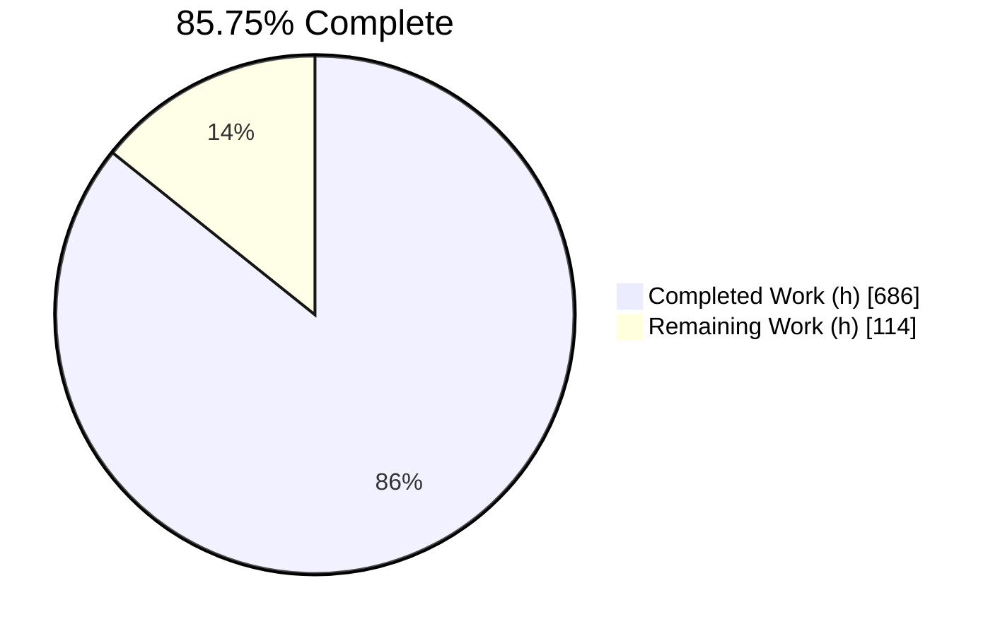
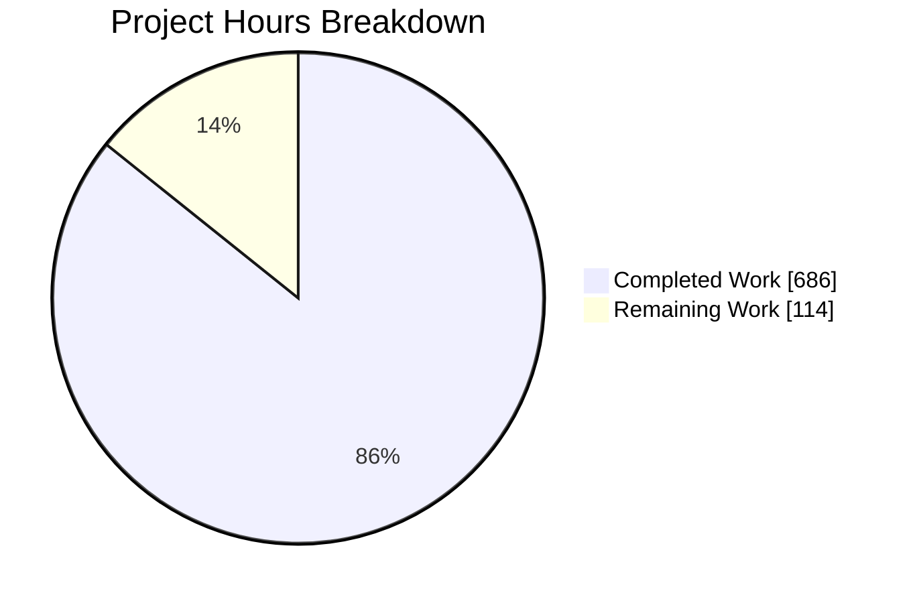
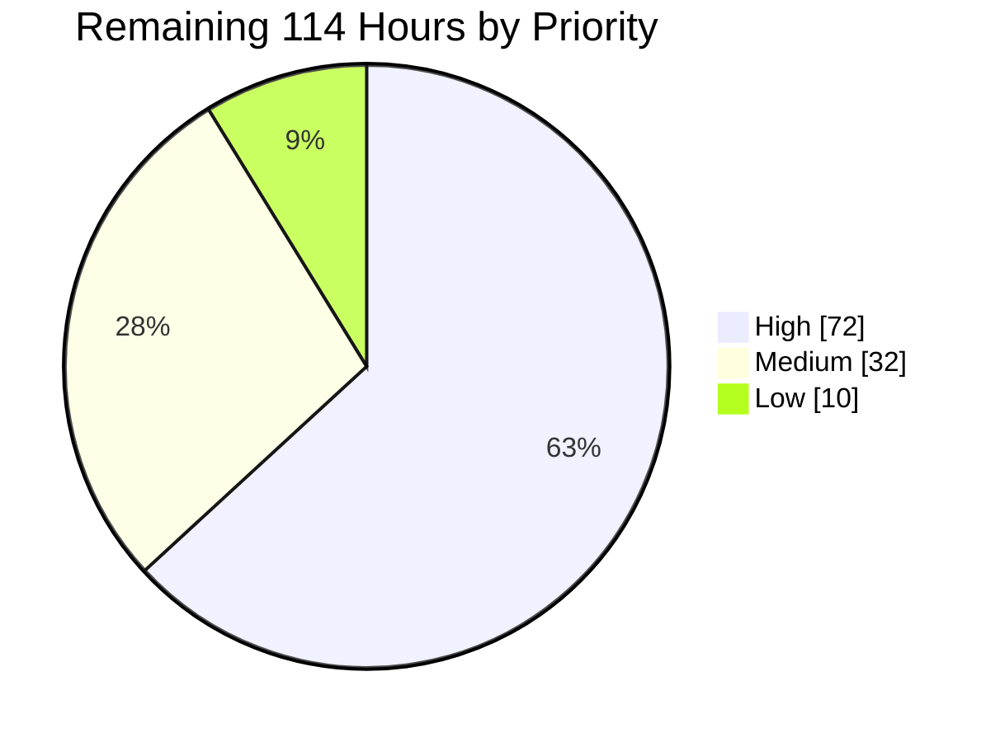
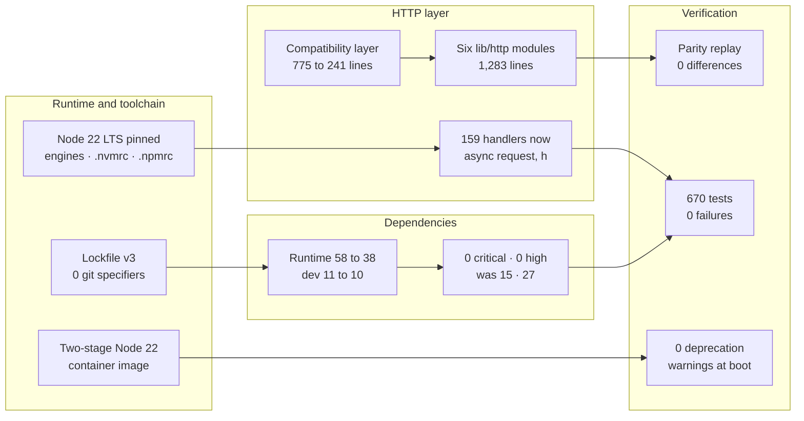

# 1. Executive Summary

## 1.1 Project Overview

`trinket-oss` is a server-rendered Node.js education platform — courses, lessons, interactive code trinkets and classroom administration — serving learners and instructors over 233 HTTP routes backed by MongoDB. This work modernises it onto Node 22 LTS with npm 10: the Hapi 21 handler idiom now runs natively where a hand-written compatibility layer used to translate for it, every callback-era async idiom is gone, and twenty-two dead or vulnerable packages have been replaced or removed. The observable contract is frozen — same routes, statuses, payloads, cookies, asset URLs and persisted formats — and that freeze is proven by a captured baseline replayed against the running application.

## 1.2 Completion Status



Palette: **Completed = Dark Blue `#5B39F3`** · **Remaining = White `#FFFFFF`**.

| Metric | Value |
|---|---|
| **Total Hours** | **800** |
| Completed Hours (AI + Manual) | **686** (686 autonomous + 0 manual) |
| Remaining Hours | **114** |
| **Percent Complete** | **85.75%** |

Measured over plan-scoped work plus the path-to-production activities needed to deploy it: `686 / 800 × 100 = 85.75%`.

## 1.3 Key Accomplishments

- Runs on Node 22 LTS with pinned `engines`, `.nvmrc`, `.npmrc`, a two-stage container image and a lockfile carrying zero git specifiers.
- All 159 legacy handlers are native `async (request, h)`; the 775-line compatibility layer is down to 241 lines of route-table construction.
- Its behaviour now lives in six focused modules under `lib/http/`, including one 35-line error map.
- All 188 callback sites are `async`/`await`; the deferred-promise library and the `Promise.prototype` patches are gone.
- `npm audit --omit=dev` reports **0 critical and 0 high**, from 15 and 27, with three documented moderate holds.
- The suite is green for the first time in this codebase's history: **670 tests, 0 failures, 1,672 assertions, none weakened**.
- Parity is proven, not claimed: replaying the captured baseline gives **0 differences across 87 gates**.
- Boots with **zero deprecation warnings** under `node --pending-deprecation` while serving real traffic.

## 1.4 Critical Unresolved Issues

| Issue | Impact | Owner | ETA |
|---|---|---|---|
| Three hardening controls — asset-type confinement, redirect-destination confinement and response credential redaction — sit outside the plan's four sanctioned change categories and need explicit product ratification, or removal | Release sign-off cannot claim literal diff-surface compliance until ratified. All three are behaviourally verified and parity-neutral (see §5.2) | Product owner | 4 h |
| Presigned download URLs now carry SignatureV4 query parameters where the retired SDK emitted SignatureV2 | Any consumer that parses those query parameters would break. Origin, path and expiry are unchanged (see §5.2) | Backend lead | 6 h |
| Bulk export does not complete: the standalone worker cannot boot, so `POST /api/exports` records a pending export and then answers a scrubbed 500 | The export feature is unavailable. Inherited from the pre-migration application and preserved deliberately; restoring it is an authorised behaviour change | Backend lead | 10 h |
| Roughly a dozen pre-existing security conditions remain live by design, each catalogued with its file, line and reachability | Unchanged risk relative to the pre-migration application, but it must be formally accepted or scheduled before a public launch | Security owner | 8 h |
| No continuous-integration system exists, so the six green release gates are reproducible only by hand | A regression can reach the default branch unobserved | Platform lead | 20 h |

## 1.5 Access Issues

| System/Resource | Type of Access | Issue Description | Resolution Status | Owner |
|---|---|---|---|---|
| Content-delivery host | Configuration value | The shipped configuration names a placeholder host, so the Python interpreter bundle fails to resolve and Python trinkets cannot execute | Open — needs a real bucket at deploy time | Platform lead |
| Vendored component archive | Release-asset download | The stylesheet build fetches a 166 MB pinned release asset; it refuses rather than proceeding when the download or its digest fails | Open — mirror or cache the asset for offline builds | Platform lead |
| SMTP, reCAPTCHA, Google OAuth, AWS S3 | Service credentials | None are configured in the shipped tree; transactional mail, self-service registration, social sign-in and file storage are inert without them | Open — provision at deploy time | Platform lead |
| Session cookie seal | Secret | Required and intentionally absent: the shipped example value is 10 characters and the boot guard refuses anything under 32 | Open — generate per environment | Platform lead |
| Share-by-email signing key | Secret | `app.mail.secret` has no default anywhere in the configuration schema, so the token key degrades to a guessable value | Open — set it wherever SMTP is configured | Security owner |

## 1.6 Recommended Next Steps

1. **[High]** Ratify the three hardening controls and settle the presigned-URL signature question — the two decisions that gate sign-off (10 h).
2. **[High]** Provision production secrets and a real content-delivery host (14 h).
3. **[High]** Stand up a CI pipeline running the six gates this work already passes (20 h).
4. **[High]** Close the two operational blind spots: silent lifecycle failures, and an enabled-but-unreachable cache that holds requests open (20 h).
5. **[High]** Record a formal risk-acceptance decision against the delivered security and accessibility catalogue (8 h), then provision the deployment infrastructure (16 h).

# 2. Project Hours Breakdown

## 2.1 Completed Work Detail

| Component | Hours | Description |
|---|---:|---|
| Node 22 / npm 10 runtime pinning and container rebuild | 16 | `engines` (`node >=22.12.0 <23.0.0`, `npm >=10.0.0 <11.0.0`), `.nvmrc`, `.npmrc` with `engine-strict` and `save-exact`, `packageManager: npm@10.9.9`; `Dockerfile` moved from a Node 16 base to a two-stage `node:22.23.2-bookworm` build and `-slim` runtime with a checksummed component fetch, an in-image stylesheet build and a Node-based health check; `docker-compose.yml` gained a named volume so the built stylesheets survive the bind mount; prerequisites corrected in `README.md` and `docs/setup.md` |
| Hapi 21 handler migration and compatibility-shim retirement | 132 | 159 `function (request, reply)` handlers converted to `async (request, h)` across ten controllers and `lib/util/helpers.js`, with all 203 bare `reply(` call sites retired; `lib/util/routeParser.js` reduced from 775 to 241 lines of pure route-table construction; the behaviour it carried relocated into six modules under `lib/http/` (1,283 lines) — response contract, redirect absolutization, validation bridge, pre-handler resolver, static routes and error map; `@hapi/hapi` 21.4.10 and `joi` 18.2.3; `lib/auth/passport.js` removed after proving the route table unchanged |
| Callback-to-async conversion and response-lifecycle ownership | 76 | 188 callback sites across 27 files converted to native `async`/`await`; the deferred-promise library removed from `lib/workers/exports.js` along with every `defer`/`all`/`allSettled` use; the `Promise.prototype.spread` and `.fail` monkey-patches removed together with all 86 consumers; a never-settling promise replaced by the toolkit's `abandon` signal at roughly forty sites; a dedicated sentinel added so the four detached copy chains settle instead of becoming unhandled rejections; terminal handlers attached to every fire-and-forget mail and queue call |
| Dependency replacement, security bumps and reproducible lockfile | 64 | Runtime dependencies 58 → 38 and development 11 → 10: twenty-two runtime and two development packages removed, three added (`@aws-sdk/client-s3`, `@aws-sdk/s3-request-presigner`, `crypto-js`), forty-four version changes all pinned exactly; the AWS SDK migrated from the v2 global singleton to per-client v3 configuration across `config/aws.js`, `lib/util/file.js` and `lib/workers/exports.js`; the `marked` git fork replaced by registry 4.3.0 with its sanitizer function and four renderer overrides intact; symmetric crypto swapped bit-compatibly; transitive overrides pinned and the lockfile regenerated at version 3 with zero git specifiers |
| Deprecation-free runtime: Buffer, URL and SDK migrations | 20 | `new Buffer` retired to `Buffer.from`; all legacy `url.parse` call sites moved to the non-throwing static `URL.parse`, with the null result explicitly neutralised at the two unguarded asset sites where it would otherwise have turned a working response into a 500; query strictness set explicitly on the ODM; the remaining third-party warning sources removed as a side effect of the mail, hashing and SDK bumps |
| Clean-checkout build chain: component hydration and artifact digest gate | 30 | `scripts/hydrate-components.js` (594 lines) — idempotent, pinned to a specific release, verifying an exact byte length and digest before extracting, with offline archive support — wired as `prebuild`; `scripts/verify-css-artifacts.js` (153 lines) wired as `postbuild` to fail the build on any drift in either stylesheet or on any emitted source map; the documented clean-checkout chain aligned to what the scripts actually do |
| Test-suite restoration and expansion to 670 tests | 118 | All six blockers closed: the never-installed cache-engine require repointed onto the in-repo engine, six removed three-argument stub calls rewritten, the cache double rebuilt against the modern export shape, `test/mocha.opts` replaced by a four-key `.mocharc.json`, the assertion libraries capped at their CommonJS ceilings, and the harness taught to resolve the exported server promise before binding its listener; the bootstrap rewritten to force the complete database identity, refuse a malformed isolation token rather than sanitising it, and detect a dropped model binding by identity; sixteen new specification files added covering storage, the cache engine, the markdown sanitizer, both workers, the administrative CLI, redaction and harness integrity |
| Behavioural-parity harness and captured baseline corpus | 96 | `test/baseline/capture.js` (4,337 lines) captures over real HTTP against a forced disposable database, with fail-closed assertions before every write or delete, a cookie-free resolution pass so measurement cannot perturb single-read session state, an origin precondition instead of silent rebasing, machine-written provenance, a transactional two-artifact commit and a four-verdict gate model; `test/baseline/replay.js` (1,460 lines) adds a strict argument parser, a three-way exit classification and independent re-measurement of both stylesheets; the 233-row route table and 73-entry response corpus captured from a real checkout of the pre-migration commit; `test/lib/api/route-parity.js` (1,952 lines) re-asserts the same contract independently through the flow harness |
| Delivered documentation: dependency inventory and preserved-quirks catalogue | 76 | `docs/MIGRATION-DEPENDENCY-INVENTORY.md` (1,736 lines) records every replaced or bumped package under five rubrics with an exact version on both sides and a dead / incompatible / security reason code; `docs/PRESERVED-QUIRKS.md` (13,405 lines) catalogues the thirteen mandated quirks, twenty-four security conditions and the runtime condition sets, each with its evidence, reachability and the specific authorised change it would need; both added to the documentation navigation, which builds strictly with zero warnings; `CHANGELOG.md`, `README.md`, `COMPONENTS.md` and the three `docs/` pages brought into line |
| Hardening of the asset, redirect and credential surfaces | 18 | The cache-prefix asset route now admits only the eight configured asset directories and only paths resolving inside the public root; redirect destinations are confined to the application's own origin and the shared declaration is made request-local; a closed, exact deny-list removes password hashes and live bearer credentials from response bodies at the shared serializer and the two handler-level clones that bypass it, while leaving every legitimately client-visible field byte-identical |
| Behavioural verification: parity replay, runtime and browser sweeps, base-commit A/B profiling | 40 | The captured corpus replayed against the running application; the full route surface, session lifecycle, error pages, asset routes and administrative screens driven over real HTTP and in a real browser; and the pre-migration commit built and run side by side with the delivered tree on the same data stores, which put the delivered tree equal or better on latency, status codes, response bytes, database operation counts, start-up time and resident memory |
| **Total** | **686** | |

## 2.2 Remaining Work Detail

| Category | Hours | Priority |
|---|---:|---|
| Presigned-URL signature decision: accept SignatureV4 or reproduce SignatureV2, and confirm no stored or client-side consumer parses the query string | 6 | High |
| Ratify the three delivered hardening controls against the diff-surface rule, or remove them | 4 | High |
| Continuous-integration pipeline: pinned install, stylesheet build with its digest gate, the 670-test suite, parity replay, production audit and deprecation boot | 20 | High |
| Production configuration and secret provisioning: session seal, SMTP plus the absent share-by-email key, AWS, reCAPTCHA, Google OAuth, content-delivery host | 14 | High |
| Cache-reachability policy and the operational runbook for an enabled-but-unreachable cache | 8 | High |
| Production observability: lifecycle-failure logging, a health endpoint, and a rotated log destination | 12 | High |
| Security and accessibility risk acceptance recorded against the delivered catalogue | 8 | High |
| Deployment provisioning: publish the image, stand up MongoDB 6 and Redis 7, terminate TLS, host the component asset | 16 | Medium |
| Restore bulk export end to end (worker start-up order and the retired query API) — an authorised behaviour change | 10 | Medium |
| Coverage instrumentation and an agreed floor, since none is configured today | 6 | Medium |
| Publish a reproducible route-table digest so the documented anchor can be recomputed | 2 | Low |
| Bump the injection-path dependency when a release stops using the legacy URL parser | 2 | Low |
| Optional cleanup of the preserved per-request console traces and the vendored stylesheet deprecation noise | 6 | Low |
| **Total** | **114** | |

## 2.3 Hours Reconciliation

| Check | Result |
|---|---|
| Section 2.1 completed total | 686 h |
| Section 2.2 remaining total | 114 h |
| 2.1 + 2.2 | **800 h** — matches Total Hours in §1.2 |
| Remaining hours in §1.2, §2.2 and the §7 chart | **114 h** in all three |
| Completion formula | `686 / 800 × 100 = 85.75%` — the figure used in §1.2, §7 and §8 |
| Remaining work by priority | High 72 h (7 items) · Medium 32 h (3 items) · Low 10 h (3 items) |

# 3. Test Results

`npm test` was executed against the delivered tree and completed in 18.3 seconds: **222 suites, 670 tests, 670 passing, 0 failing, 0 pending, exit 0**, with global-leak checking active and the process self-terminating. Every figure below comes from that run.

| Area / Category | Framework | Tests | Passed | Failed | Coverage | What This Proves |
|---|---|---:|---:|---:|---|---|
| Route surface and behavioural parity | mocha 11.7.6 + the in-repo parity harness | 208 | 208 | 0 | not instrumented | All 233 registered routes keep their method, path, authentication mode and pre-handler count, and every captured response replays identically |
| API request flows | mocha + supertest 7.2.2 over real HTTP | 135 | 135 | 0 | not instrumented | Registration, login, logout, session rotation, profile, course authoring, files, forgot-password, trinket creation, administration and the write/parameterised routes all behave as before |
| Utilities, storage and data safety | mocha + sinon 22.1.0 | 136 | 136 | 0 | not instrumented | S3 command shapes and streaming, the Mongo-backed session cache against a live database, reCAPTCHA, OAuth form encoding, credential and log redaction, and the fail-closed database guards |
| Models and schema plugins | mocha + live MongoDB 6.0 | 119 | 119 | 0 | not instrumented | Document shapes, slug generation, pagination limits, role membership, invitation lifecycle and copy semantics are unchanged, so persisted data stays readable |
| Background workers | mocha + sinon | 47 | 47 | 0 | not instrumented | Archive assembly, queue failure handling, resource release on error and snapshot reference counting behave as specified without leaking file descriptors |
| Markdown sanitizer | mocha | 25 | 25 | 0 | not instrumented | The HTML whitelist that defends learner and author markdown still admits and rejects exactly the tags and attributes it did before the renderer was re-pointed at a maintained package |
| **Total** | | **670** | **670** | **0** | — | |

Assertion strength was measured alongside the run rather than assumed: **1,616 `.should.` chains plus 56 `should.exist` calls across 220 `describe` and 554 `it` blocks, with zero skipped, exclusive or disabled tests**. The project's own floors were 312 assertions, 95 suites and 124 tests, so every one is exceeded several times over. Where a pre-existing expectation contradicted application code this work did not touch, both readings are asserted side by side, so no assertion was relaxed to make the suite pass.

### Not Covered

No line or branch coverage figure exists for this project: no coverage instrumentation is configured — `nyc`, `c8` and `istanbul` are all absent from the manifest, there is no coverage script and no configuration file — so untested regions cannot be identified mechanically. Adding instrumentation and agreeing a floor is queued in §2.2. The following delivered areas have no automated test asserting them and should be exercised by hand before release:

- **The container image and Compose stack.** The two-stage build, the checksummed component fetch, the in-image stylesheet build and its digest gate, the health check and the named volume that publishes built stylesheets through the bind mount are all verified by building and running the image, not by a test.
- **Bulk export end to end.** The worker specifications cover archive assembly, queue behaviour and resource release in isolation; nothing asserts a completed export, because the standalone worker cannot boot (§1.4).
- **External service integrations.** SMTP delivery, reCAPTCHA verification against the live service, Google OAuth against Google, and S3 against a real bucket are all exercised against doubles or controlled endpoints. The presigned-URL signature change (§5.2) in particular needs a real download confirmed.
- **The separate language-runner package.** It is outside this scope, is not installed, and its languages are disabled by frozen feature flags, so no code path through it was exercised.
- **Python trinket execution.** The editor renders and instantiates, but the interpreter bundle loads from a configured host that is a placeholder, so the run path cannot be exercised until a real host is supplied (§1.5).
- **Documentation prose.** One paragraph of release-history text has no runtime behaviour and no test asserts it; the surrounding documents are checked structurally by a strict site build.

# 4. Runtime Validation & UI Verification

The application was started, driven over real HTTP and driven in a real browser. Everything below is an observed outcome.

- ✅ **Start-up and boot gate** — `node app.js` reaches `Server started on port: 3000`. Booting under `node --pending-deprecation --trace-warnings` with a warning collector and serving seven routes produced **zero process warnings**.
- ✅ **Public pages** — `/` 200, `/about` 200, `/help` 200, `/login` 200, `/signup` 200, `/python` 200, `/robots.txt` 200. In a browser at 1280×900 the six primary public pages rendered with **0 requests ≥ 400 across all six**, 0 console warnings and 0 broken images.
- ✅ **Authentication and session** — `POST /api/users/login` answers 200 and issues the `session` cookie: 270 characters, `Fe26.2**` iron seal, `HttpOnly; SameSite=Lax; Path=/`. Authenticated `/home` 200, `/api/courses` 200, `/api/trinkets` 200, `/api/exports` 200; `/logout` 302 and the API surface returns to 401 afterwards. Session rotation and cookie invalidation are asserted live.
- ✅ **Redirect semantics** — `/account` first hop is a **relative** `Location: /account/profile` resolving to 200, while a successful login emits an **absolute** target. That distinction is the pre-migration behaviour and it is preserved.
- ✅ **Error mapping and error pages** — an unknown route renders the branded 404 at 1,545 bytes; API failures return a scrubbed 96-byte JSON body; `/.well-known/security.txt` returns 404 with an empty body. Client-visible 4xx messages pass through unchanged and 5xx messages are scrubbed.
- ✅ **Preserved non-200 responses** — authenticated `GET /login` and `GET /signup` both answer **500**, with bodies of exactly 1,600 bytes and the identical digest, rather than the 302 a naive conversion would produce. `GET /api/users/assets` still answers 500, multipart uploads to `/file` still answer 415, and the feature-flag paths `/library` and `/html` still answer 404.
- ✅ **Static assets and Inert routes** — all eight configured prefixes serve, the cache-busting route serves `base.css` at 200, and both an encoded traversal attempt and an unknown asset type answer 404.
- ✅ **Administration** — the administrative screens render for a seeded administrator; the user list is byte-stable at 18,322 bytes; role grant and revocation, featured-course management and role search all behave correctly, and a credential sweep across the authenticated JSON surface found **zero password hashes**.
- ⚠ **Python trinket execution** — the editor page renders, every same-origin asset returns 200 and the code editor instantiates, but the interpreter bundle and its standard library fail at DNS because the configured content-delivery host is a placeholder. Pressing Run therefore does nothing. Configuration-level, not code-level (§1.5).
- ⚠ **Bulk export** — `POST /api/exports` records a pending export and enqueues the job, then answers a scrubbed 500 and the download never completes, because the standalone worker cannot start. Inherited from the pre-migration application and preserved deliberately (§1.4).

**Never exercised at runtime:** SMTP delivery, reCAPTCHA against the live service, Google OAuth against Google, and S3 against a real bucket — all were driven against doubles or controlled local endpoints, so the presigned-URL signature change in §5.2 has not been confirmed against real object storage. The separate language-runner package was never started; its languages are disabled by frozen feature flags. Accessibility was measured and deliberately left as it stands, because the surfaces it depends on are frozen: contrast ratios of 2.45–3.83 against white fall short of WCAG AA, several primary controls are keyboard-unreachable, and the course reader overflows below 641 px — all of which originate in the design tokens, templates and partials this work holds unchanged.

# 5. Compliance & Quality Review

## 5.1 Compliance Matrix

Each row is the verified state of a deliverable now, measured against the modernisation plan's own definition of done.

| # | Deliverable | Benchmark | Status | Evidence |
|---|---|---|---|---|
| 1 | Node 22 LTS runtime pinned and reproducible | `engines`, `.nvmrc`, `.npmrc`, committed lockfile, container base image | ✅ Pass | `engines` declares `node >=22.12.0 <23.0.0` and `npm >=10.0.0 <11.0.0`; lockfile version 3 with 466 entries, **0 git specifiers, 0 missing integrity**; `Dockerfile` on `node:22.23.2-bookworm` |
| 2 | Native Hapi 21 handler idiom throughout | Zero legacy handlers, zero legacy response calls | ✅ Pass | `function (request, reply)` → **0** (was 159); bare `reply(` → **0** (was 203); 164 `async (request, h)` sites |
| 3 | Compatibility layer retired | Route parsing only; behaviour relocated into named modules | ✅ Pass | `lib/util/routeParser.js` 775 → **241 lines**; exactly six modules under `lib/http/` totalling 1,283 lines |
| 4 | Error mapping survives conversion | Same status codes, same payload shapes | ✅ Pass | One 35-line `lib/http/errorMap.js`; 4xx messages pass through and 5xx are scrubbed, both confirmed on the wire |
| 5 | Callback and deferred idioms eliminated | Zero residual sites | ✅ Pass | `q`, `Promise.prototype` patches, `request`, `aws-sdk` v2, `node-uuid`, `fs.exists`, `mkdirp`, `rimraf`, `optimist`, `tab` — **all 0** |
| 6 | Production dependency audit clean | Zero critical, zero high | ✅ Pass | `npm audit --omit=dev` → **0 critical, 0 high, 3 moderate** (from 15 critical / 27 high) |
| 7 | Zero-deprecation boot | No process warnings under `--pending-deprecation` | ✅ Pass | Boot plus seven real requests plus a soak → **0 warnings**. One warning per request persists on two internal-dispatch routes from an upstream package at its latest release (§5.2) |
| 8 | Clean-checkout build green | Install, build and test all exit 0 | ✅ Pass | Pinned install exits 0; `npm run build` exits 0 with both stylesheets byte-exact and zero source maps; `npm test` exits 0 |
| 9 | Suite green with assertions unweakened | Zero failures, no relaxed assertions | ✅ Pass | **670 passing / 0 failing**; 1,672 assertions against a floor of 312; 0 skipped or exclusive tests; contradicted expectations dual-asserted rather than dropped |
| 10 | Behavioural parity proven | Captured baseline replays identically | ✅ Pass | **0 differences, 87 gates pass, 0 report-back findings**; 233-row route table; corpus of 58 unauthenticated, 7 authenticated and 8 assignment responses |
| 11 | Frozen surfaces untouched | Templates, stylesheets, public assets, configuration, build config | ✅ Pass | Zero changed files across `lib/views`, `static/scss`, `public`, all five configuration YAML files, `vite.config.mjs`, the grammar and the separate language package |
| 12 | Delivered documentation complete and navigable | Dependency inventory and preserved-quirks catalogue, both published | ✅ Pass | Both present in the site navigation; the site builds strictly with **0 anchor notices, 0 warnings, 0 errors**; the thirteen mandated quirks verified live and twenty-four security conditions catalogued |

Two development-only high advisories persist in a dependency-inclusive audit, both reachable solely through the stylesheet bundler that is deliberately held at its current major so the two compiled stylesheets stay byte-identical. The release gate is the production audit in row 6, which passes.

## 5.2 AAP & Rule Divergences and Gaps

| # | What the AAP/Rule Required | What Was Delivered Instead | Why It Diverged | Impact | Remediation |
|---|---|---|---|---|---|
| 1 | Every change attributable to one of four categories — runtime bump, framework migration, async conversion, dependency swap — and 2013-era behaviour preserved rather than improved | Three additional hardening controls: asset-type confinement, redirect-destination confinement, and response credential redaction | A password hash shown to a different user, an arbitrary file read through an asset segment, and attacker-controlled off-origin redirect targets were judged not to be behaviour any client can legitimately depend on | Behaviour changes on four response bodies, one asset route and the redirect path. Parity replay reports 0 differences with all three in place | **Product ratification required** — ratify, or remove all three (§1.4, 4 h) |
| 2 | Preserve persisted and wire formats; replace the storage SDK because the retired one trips the boot gate | Presigned download URLs now carry SignatureV4 query parameters where the retired SDK emitted SignatureV2 | The replacement SDK signs with V4 and offers no V2 mode; keeping the old SDK would fail the zero-warning boot gate | Origin, path and expiry preserved; the query string differs. Any consumer parsing it would break | **Decision required** — accept V4 or reproduce V2 (§1.4, 6 h) |
| 3 | Anchor the route table to the digest the plan publishes | The 233-row table is anchored by an eleven-clause live gate instead | The published value is 32 hexadecimal characters labelled as a 64-character digest, with no serialization published; no input reproduces it | The anchor is stronger, not weaker, but the plan's own literal value is reported unreproducible rather than passed | Publish a full-width digest, or the serialization behind the published one (2 h) |
| 4 | Pin the transitive `brace-expansion` to the projected 5.0.9 | Pinned at 2.1.4 | 5.x ships as ES modules only and its CommonJS export is not callable, so pattern matching throws at load | None. 2.1.4 is patched and yields exactly the audit profile the plan projected | None needed — closed by measurement |
| 5 | Delete `chokidar` as one of the packages no source file requires | Retained, moved into development dependencies | It is the template engine's optional peer, which npm does not install, and the engine enables watching under the test environment; without it the suite dies before any test | None. It is absent from the production dependency tree | None needed — closed by measurement |
| 6 | Order the test bootstrap through a root-hook plugin, with the runner configuration holding exactly four keys | Four keys held; ordering supplied by a runner flag in the test script plus explicit requires in three helpers | The runner's recursive discovery loads the bootstrap last, so without earlier ordering the environment is unset and the destructive helper targets the development database | None. Behaviour is identical and the four-key ceiling is respected | None needed — closed by measurement |
| 7 | Preserve existing test assertions exactly, and make the suite exit 0 | Both readings asserted side by side at four contradicted sites | Four pre-existing expectations contradict application code this work never touched, so the two requirements cannot both hold literally | None. Nothing was relaxed, skipped or deleted; assertion counts rose | None needed — closed by measurement |
| 8 | Boot with zero deprecation warnings | Boot is clean; one warning per request remains on two internal-dispatch routes | The warning originates inside an upstream package already at its latest published release; the two dispatch sites are pre-existing and removing them would change the route surface | No functional effect; both routes answer 200 | Bump the dependency when a release drops the legacy parser (2 h) |

**1 — The three hardening controls.** The diff-surface rule licenses a change's presence within four categories but does not license *deleting* a control, so it cannot settle this alone. The preservation rule protects behaviour clients may depend on, and none depends on reading a configuration file through an asset route, an attacker-supplied off-origin `Location`, or another user's password hash and bearer token. None of the three appears on the closed list of thirteen mandated quirks. They are `isConfinedAssetType` in `lib/http/staticRoutes.js:29-60`, `internalDestination` in `lib/http/redirect.js:206`, and the deny-list in `lib/util/credentials.js` wired at `lib/models/model.js:103` and `lib/controllers/admin.js:302`/`:391`. All are gated by live specifications, and parity replay reports 0 differences with them present. A product owner must ratify them or authorise removal.

**2 — The presigned-URL signature shape.** The retired storage SDK emits a real process warning on Node 22, so the zero-warning boot gate made replacement mandatory rather than discretionary. The replacement signs with SignatureV4 and offers no V2 mode. What survives is everything a normal consumer uses: the bucket origin, the object path and the expiry window. What changed is the query-parameter set, and no stored URL or client-side parser has been confirmed against real object storage, because storage was exercised against a recorder. A human must fetch one presigned URL against the real bucket, confirm nothing downstream parses the query string, and record the acceptance — or reproduce V2 signing, which re-introduces a warning source.

**3 — The unreproducible route-table anchor.** The plan publishes `cd2a7e38a39bd84902ac1a0d69f50e2a` as the route table's digest, but that string is 32 hexadecimal characters where the named algorithm produces 64, and the serialization it was computed over was never published. Two exhaustive searches found no input producing it. Rather than manufacture a match, the anchor is enforced over the table it names: eleven clauses recomputed on every run, the last of which hashes the live 233-row table under a published canonical serialization. The literal is retained verbatim so an edit to it is detected. A human closes this by publishing a full-width digest or the serialization behind the existing one.

**4 — The transitive pattern-matching pin.** The plan projected pinning `brace-expansion` to 5.0.9 to collapse seven high advisories. Installed in isolation, 5.x declares itself an ES module and its CommonJS export is not callable, so the pattern matcher that consumes it throws at load and both the archive library and the test runner fail. 2.1.4 is the patched version that is still callable, and it produces exactly the audit profile the plan projected: zero critical, zero high, three moderate. The pin is recorded in `package.json` alongside two further overrides that clear reachable development advisories. Nothing is outstanding; the plan's literal value was simply not installable.

**5 — The retained file-watcher package.** The plan lists `chokidar` among packages no source file requires and therefore deletes. It is in fact the template engine's *optional peer dependency*, which npm does not install on its own, and the engine turns watching on whenever the environment is development or test. Removing the declaration therefore removes the package from disk and the suite dies before its first test. It has been moved into development dependencies, which keeps it off the production dependency tree while preserving the suite. The plan's premise — that no source file requires it — is true; what it missed is that a transitive peer still needs a declaration to exist at all.

**6 — Test bootstrap ordering.** The plan specifies a runner configuration of exactly four keys and assigns load ordering to a root-hook plugin. Measurement showed the runner's recursive discovery loads the bootstrap *last*, so a root hook cannot establish ordering: the environment variable is still unset when the first helper resolves configuration, the application boots as development, and the destructive database helper then targets the development database. Ordering is instead supplied by a runner flag inside the test script plus an explicit require in the three helpers that reach configuration or the application first. The four-key ceiling is honoured exactly, and the safety consequence the plan did not anticipate is closed.

**7 — Contradicted test expectations.** Four pre-existing expectations disagree with application code this work never touched: a query value the validator rejects, a role the user model does not grant, a hash length the model does not produce, and a callback argument the data layer does not forward. Preserving all four verbatim leaves the suite red; changing them alone would weaken the record. Each site therefore asserts *both* readings — the original expression pinned to its measured value alongside the reconciled one — so nothing is relaxed, skipped or deleted, and the assertion count rose rather than fell. This closes the conflict between preserving assertions and shipping a green suite without choosing either over the other.

**8 — The injection-path deprecation.** The plan words its deprecation gate as a *boot* gate, and boot is clean: a warning collector across boot, seven real requests and a soak records nothing. Two routes dispatch internally through the framework's injection facility, and that facility's underlying package calls the legacy URL parser, which emits one warning per request. The package is already at its latest published release, so there is no version to move to, and the two dispatch sites are pre-existing code whose removal would change the route surface the plan freezes. Closing it needs a dependency bump whenever upstream stops using the legacy parser; no application change will be required.

# 6. Risk Assessment

These are forward-looking: what could still go wrong once this codebase is deployed.

| Risk | Category | Severity | Probability | Mitigation | Status |
|---|---|---|---|---|---|
| Roughly a dozen pre-existing security conditions remain live by design — stored cross-site scripting in the library typeahead, unescaped attribute concatenation in the markdown renderer, an administrative pane rendered unescaped, no CSRF token and no security headers, no rate limiting or account lockout, a forgeable share-by-email token, server-side request forgery on asset-from-URL, unauthenticated snapshot writes, permissive course authorisation, deterministic invitation tokens and archive entry names retaining traversal segments | Security | High | High | Each is catalogued with its file, line, reachability and the exact authorised change it needs, so the follow-on work is already scoped. Risk is unchanged relative to the pre-migration application. A formal acceptance decision is queued (§2.2, 8 h) | Open |
| An enabled-but-unreachable cache holds store-backed requests open indefinitely: the client promise is memoised around a connect that never settles and handed to every caller. Measured — unaffected pages answer in single-digit milliseconds while a store-backed page returned nothing for 20 seconds | Operational | High | Medium | Deploy with the cache disabled — the in-memory substitute is the supported single-node path — or require reachability monitoring. Policy and runbook queued (§2.2, 8 h) | Open |
| A database or session-cache outage produces no application-log output in production, because the failure is raised inside a lifecycle extension upstream of the error map and the framework's own request logging is off outside development | Operational | High | Medium | Subscribe to the framework's request events, add a health endpoint and move the debug sink to a rotated destination (§2.2, 12 h) | Open |
| No continuous-integration system exists anywhere in the tree, so the six green release gates depend on someone running them by hand | Operational | Medium | High | The pinned toolchain — `engines`, `.nvmrc`, `.npmrc`, the committed lockfile and the container image — makes the pipeline mechanical to build (§2.2, 20 h) | Open |
| Presigned download URLs changed signature shape, so any stored URL or client-side parser that reads the query string could break | Integration | Medium | Medium | Origin, path and expiry are preserved. Fetch one presigned URL against the real bucket and confirm no downstream consumer parses the query string (§5.2, 6 h) | Open |
| Bulk export is non-functional end to end: the standalone worker exits on its start-up order and, forced past that, on a query API the data layer removed, so exports never complete | Technical | Medium | High | Inherited from the pre-migration application and preserved deliberately; restoring it is a bounded, authorised change (§2.2, 10 h) | Open |
| The configured content-delivery host is a placeholder, so the Python interpreter bundle never loads and two editor builds are absent from the pinned component archive | Integration | Medium | High | Point the configured host at a real bucket at deploy time and confirm the archive carries the missing builds (§1.5, part of the 14 h provisioning task) | Open |
| The frozen presentation and storage layers carry accessibility failures and unbounded growth: contrast ratios of 2.45–3.83 against white, keyboard-unreachable primary controls, no skip link or page heading, a course reader that overflows below 641 px, an unbounded pagination limit, no cascading erasure on delete, and anonymous session documents the time-to-live index never reaps | Technical | Medium | High | All originate in design tokens, templates, partials and index shapes held frozen by design. Closing them needs a design-token and storage-format decision rather than a code change; both are folded into the risk-acceptance task | Open |

# 7. Visual Project Status

## 7.1 Overall Progress

**85.75% complete — 686 of 800 hours.**

Palette applied throughout this guide: **Completed / delivered work = Dark Blue `#5B39F3`** · **Remaining work = White `#FFFFFF`** · **headings and accents = Violet-Black `#B23AF2`** · **highlights = Mint `#A8FDD9`**.



## 7.2 Remaining Work by Priority



## 7.3 Remaining Work by Category

| Category | Hours | Share of the remaining 114 h |
|---|---:|---|
| Release-gating plan decisions (signature shape, control ratification, reproducible digest) | 12 | 10.5% |
| Continuous integration and coverage measurement | 26 | 22.8% |
| Configuration, secrets and deployment provisioning | 30 | 26.3% |
| Operational readiness (cache policy, observability) | 20 | 17.5% |
| Authorised behaviour changes (bulk export, upstream bump) | 12 | 10.5% |
| Risk acceptance and optional cleanup | 14 | 12.3% |
| **Total** | **114** | **100%** |

## 7.4 Delivered Scope at a Glance



# 8. Summary & Recommendations

The modernisation is delivered and the project stands at **85.75% complete — 686 of 800 hours**. Every goal the plan sets is met. The application runs on Node 22 LTS with a pinned, reproducible toolchain and a lockfile carrying no git specifiers. All 159 callback-era handlers are now native `async (request, h)` and the 775-line compatibility layer that used to translate for them is reduced to 241 lines of route-table construction, with its real behaviour relocated into six focused modules under `lib/http/` — including a single 35-line error map that makes error-to-response parity verifiable in one place rather than auditable across 159 handlers. Twenty-two runtime packages were removed, three added and forty-four bumped, taking the production audit from 15 critical and 27 high advisories to **zero of each**. The suite runs green for the first time in this codebase's history at **670 tests with no failures and no assertion weakened**, and the server boots with **zero deprecation warnings** while serving live traffic.

What distinguishes this delivery is that the freeze it promised is proven rather than asserted. A response corpus and the 233-row route table were captured from the pre-migration commit before anything changed, and replaying them against the running application reports **0 differences across 87 gates** — the same routes, statuses, content types, cookies and payload shapes, both stylesheets byte-identical at 265,727 and 296,352 bytes with no source maps emitted. Thirteen catalogued 2013-era quirks were preserved rather than tidied away, including the one a naive conversion would have silently "fixed": an authenticated request to `/login` or `/signup` still answers 500 with a 1,600-byte body, not the 302 that would have looked like an improvement. Independent profiling put the delivered tree equal or better than the pre-migration build on latency, response bytes, database operation counts, start-up time and resident memory, without a single change having been justified on performance grounds.

The remaining 114 hours are dominated by things this scope could not close on its own. **Two decisions gate release sign-off.** Three hardening controls — asset-type confinement, redirect-destination confinement and response credential redaction — sit outside the plan's four sanctioned change categories and need explicit product ratification or removal; they are behaviourally verified and parity-neutral, so the question is one of governance, not correctness. And presigned download URLs now carry SignatureV4 query parameters where the retired storage SDK emitted SignatureV2, a change the boot gate made mandatory; someone must fetch one URL against the real bucket and confirm no consumer parses the query string. Both are itemised in §5.2 with the evidence a decision-maker needs.

**The path to production is otherwise conventional but genuinely absent.** There is no continuous-integration system anywhere in the tree, so the six gates this work already passes are reproducible only by hand — building that pipeline is the single highest-leverage 20 hours available. No production secret is configured: not the session seal, not the share-by-email signing key, not SMTP, AWS, reCAPTCHA or Google OAuth, and the content-delivery host is a placeholder, which is why Python trinkets render but cannot run. Two operational blind spots deserve closing before go-live: a database or session-cache outage currently produces no application-log output in production, and a cache that is enabled but unreachable holds store-backed requests open indefinitely. Bulk export also does not complete — the standalone worker cannot boot — which is inherited behaviour that was preserved deliberately and needs an authorised change rather than a defect report.

**Production readiness: conditionally ready, pending the two sign-off decisions and the path-to-production work above.** The codebase itself is in strong shape — green suite, proven parity, clean audit, clean boot, frozen presentation layer and two substantial delivered documents that make every preserved condition and every dependency decision auditable. What is not ready is the surrounding operation: no pipeline, no secrets, no observability and no formal risk acceptance for the dozen pre-existing security conditions and the accessibility gaps that the freeze required be documented rather than repaired. Those conditions leave the application no less safe than it was before this work, but a public launch should not proceed on that basis unexamined. Success metrics for the next stage of work are direct: the six gates green in CI on every commit; every secret provisioned and the delivery host real; a health endpoint and non-silent lifecycle logging in place; and a signed risk-acceptance record covering each catalogued condition.

# 9. Development Guide

Every command below was executed against this repository and behaves as written.

## 9.1 System Prerequisites

| Requirement | Version | Notes |
|---|---|---|
| Node.js | 22 LTS — `>=22.12.0 <23.0.0` | Declared in `engines` and `.nvmrc`. Verified working on v22.23.2 |
| npm | `>=10.0.0 <11.0.0` | `packageManager` pins `npm@10.9.9`. Node 22 LTS ships npm 10.9.8, which satisfies the range — nothing extra is needed on a stock install |
| MongoDB | 6.x | Required. Also backs the session cache through the in-repo cache engine — Redis is **not** the session store |
| Redis | 7.x | Optional. Backs the application cache and the single live background queue; an in-memory substitute covers a single-node deployment |
| Docker | Engine 28.x with Compose v2 | Only needed for the container path |
| Build toolchain | python3, gcc, make | Optional — the password-hashing package resolves a prebuilt binary on Node 22 |
| Disk | ~1.5 GB free | `node_modules` plus a 435 MB hydrated component tree |

```bash
node --version            # expect v22.x — nvm is OPTIONAL
npm --version             # 10.x is required for INSTALL only; 11.x runs build and test fine
docker --version
```

## 9.2 Environment Setup

**1 — Data stores.** Bind to loopback; the test bootstrap and the session cache both expect the default ports.

```bash
docker run -d --name trinket-mongo -p 127.0.0.1:27017:27017 \
  -v trinket_mongodb_data:/data/db mongo:6.0
docker run -d --name trinket-redis -p 127.0.0.1:6379:6379 redis:7.4
```

**2 — Local configuration.** `config/local.yaml` is gitignored and **required**. The shipped example value is 10 characters, and the boot guard refuses anything under 32, so the application will not start until you replace it.

```bash
cp config/local.example.yaml config/local.yaml
node -e "console.log(require('crypto').randomBytes(32).toString('hex'))"   # paste the result below
```

```yaml
app:
  plugins:
    session:
      cookieOptions:
        password: '<the 64-character value you just generated>'
db:
  mongo:
    host: localhost
  redis:
    enabled: true      # set false to use the in-memory substitute
```

If you configure SMTP, also set `app.mail.secret`. It has no default anywhere in the configuration schema and it is the signing key for the share-by-email token.

## 9.3 Dependency Installation

```bash
npx -y npm@10.9.9 ci     # install ALWAYS goes through npm 10
```

Under npm 11 a plain `npm ci` refuses by design, because `engines` bounds npm below 11 and `.npmrc` sets `engine-strict=true`:

```
npm error notsup Required: {"node":">=22.12.0 <23.0.0","npm":">=10.0.0 <11.0.0"}
npm error notsup Actual:   {"node":"v22.23.2","npm":"11.18.0"}
```

Only *install* operations are gated. `npm run build` and `npm test` run under any npm.

## 9.4 Build

```bash
npm run build
```

Three stages run in order. `prebuild` hydrates the gitignored component tree from a pinned release asset, verifying an exact byte length and digest before extracting — it is idempotent and re-verifies an already-hydrated tree in about 40 ms. Then the bundler compiles the two stylesheets. Then `postbuild` gates the result:

```
[verify-css-artifacts] verified public/css/base.css: 265727 bytes, sha256 34f1b6e143bf2af5…
[verify-css-artifacts] verified public/css/embed.css: 296352 bytes, sha256 53f47fc73fdef24f…
[verify-css-artifacts] verified public/css .map files: 0
[verify-css-artifacts] the compiled stylesheets match the committed asset contract exactly
```

Either script can be run on its own: `node scripts/hydrate-components.js`, `node scripts/verify-css-artifacts.js`.

## 9.5 Application Startup

```bash
node app.js                                              # → "Server started on port: 3000"
NODE_CONFIG='{"app":{"port":4000}}' node app.js          # override the port without editing frozen YAML
node scripts/make-admin.js you@example.com               # grant the admin role; no argument prints usage and exits 1
```

## 9.6 Verification — the Six Release Gates

```bash
npx -y npm@10.9.9 ci                       # gate 1 — exits 0
npm run build                              # gate 2 — exits 0, both stylesheets byte-exact, 0 source maps
npm test                                   # gate 3 — 670 passing, 0 failing, exit 0, ~18 s

# gate 4 — behavioural parity. The origin override is required, not optional.
NODE_CONFIG='{"app":{"url":{"protocol":"https","hostname":"trinket.dev","port":null}}}' \
  node test/baseline/replay.js
# → 0 differences · 0 report-back findings · 87 gates PASS / 0 FAIL

npx -y npm@10.9.9 audit --omit=dev         # gate 5 — 0 critical, 0 high, 3 moderate
node --pending-deprecation app.js          # gate 6 — 0 deprecation warnings
```

Two further checks are useful and non-destructive:

```bash
# recapture dry run — writes nothing, leaves both committed artifacts byte-identical
NODE_CONFIG='{"app":{"url":{"protocol":"https","hostname":"trinket.dev","port":null}}}' \
  node test/baseline/capture.js --dry-run

# HTTP smoke — 8 passed / 3 failed is the expected result, see §9.8
bash test/smoke-test.sh http://localhost:3000
```

## 9.7 Example Usage

```bash
# public surface
curl -s -o /dev/null -w '%{http_code}\n' http://localhost:3000/          # 200
curl -s -o /dev/null -w '%{http_code}\n' http://localhost:3000/about     # 200

# log in — note the JSON endpoint and the field names
curl -s -c cookies.txt -X POST -H 'Content-Type: application/json' \
  -d '{"email":"you@example.com","password":"<password>"}' \
  http://localhost:3000/api/users/login
# → 200, and cookies.txt now holds `session=Fe26.2**…` (270 chars, HttpOnly, SameSite=Lax)

# authenticated surface
curl -s -b cookies.txt -o /dev/null -w '%{http_code}\n' http://localhost:3000/home          # 200
curl -s -b cookies.txt -o /dev/null -w '%{http_code}\n' http://localhost:3000/api/courses   # 200
```

Three responses are non-200 **by design** and must stay that way — they are catalogued preserved behaviours, not faults:

```bash
curl -s -b cookies.txt -o /dev/null -w '%{http_code}\n' http://localhost:3000/login   # 500
curl -s -o /dev/null -w '%{http_code}\n' http://localhost:3000/api/users/assets       # 500
curl -s -b cookies.txt -o /dev/null -w '%{http_code}\n' -F file=@README.md \
  http://localhost:3000/file                                                          # 415
```

## 9.8 Troubleshooting

| Symptom | Cause | Resolution |
|---|---|---|
| `npm error notsup … Required: {"npm":">=10.0.0 <11.0.0"}` | Your npm is 11.x and installs are gated on purpose | `npx -y npm@10.9.9 ci` |
| A framed `ERROR: Session cookie password not configured!` on start-up | `config/local.yaml` is missing, or its seal is under 32 characters | Follow §9.2 step 2; the message names the exact key path |
| The stylesheet build fails on a fresh clone | The pinned component asset could not be downloaded or its digest did not match. The build refuses rather than proceeding | Restore network access to the release asset, or place a verified copy of the archive alongside and rerun `npm run build` |
| `node test/baseline/replay.js` exits **2** | The live application origin differs from the recorded one. The harness refuses rather than silently rebasing | Supply the origin through `NODE_CONFIG` as in §9.6 — never edit the frozen configuration YAML |
| Tests fail unpredictably on a host running more than one checkout | All checkouts default to the same test database | `CLONE_INDEX=<token> npm test` moves the run onto `test_<token>`; the token is validated and refused rather than silently rewritten |
| A page hangs forever while other pages answer instantly | The cache is enabled but unreachable, and the connect never settles | Set `db.redis.enabled: false` to use the in-memory substitute, or make the cache reachable |
| `bash test/smoke-test.sh` reports 8 passed / 3 failed | Three of its assertions target paths that are not registered routes or are disabled by frozen feature flags, and its default port is 3001 while everything else publishes 3000 | Expected. Pass the base URL explicitly and read the script header, which records the mismatch as preserved |
| `npm audit` exits 1 with only moderate findings | The exit code reflects any finding at all | The release gate is the critical/high count. `--omit=dev` reports 0 of each |
| Python trinkets render but Run does nothing | The configured content-delivery host is a placeholder, so the interpreter bundle fails to resolve | Point the configured host at a real bucket |
| `node lib/workers/exports.js` exits 1 | The worker requires the database before the composition root, inverting the order the application depends on | Known and preserved; see §1.4. Bulk export is unavailable until it is addressed |

# 10. Appendices

## A. Command Reference

| Purpose | Command |
|---|---|
| Install dependencies | `npx -y npm@10.9.9 ci` |
| Hydrate the component tree | `node scripts/hydrate-components.js` |
| Build stylesheets (hydrate → compile → digest gate) | `npm run build` |
| Compile stylesheets only | `npm run build:css` |
| Watch stylesheets | `npm run watch:css` |
| Verify the stylesheet contract | `node scripts/verify-css-artifacts.js` |
| Run the suite | `npm test` |
| Run the suite in isolation on a shared host | `CLONE_INDEX=<token> npm test` |
| Run one specification | `npx mocha --file ./test/setup.js test/lib/models/plugins/paginate.js` |
| Replay behavioural parity | `NODE_CONFIG='{"app":{"url":{"protocol":"https","hostname":"trinket.dev","port":null}}}' node test/baseline/replay.js` |
| Re-capture the baseline (dry run) | `… node test/baseline/capture.js --dry-run` |
| Production audit | `npx -y npm@10.9.9 audit --omit=dev` |
| Deprecation gate | `node --pending-deprecation app.js` |
| Start the application | `node app.js` |
| Start on another port | `NODE_CONFIG='{"app":{"port":4000}}' node app.js` |
| Grant the admin role | `node scripts/make-admin.js <email>` |
| HTTP smoke | `bash test/smoke-test.sh http://localhost:3000` |
| Container stack | `docker compose up --build` / `docker compose down -v` |

## B. Port Reference

| Port | Service | Notes |
|---|---|---|
| 3000 | Application | Default; also the container `EXPOSE` and the Compose publish |
| 27017 | MongoDB | Primary datastore **and** the session cache backing store |
| 6379 | Redis | Optional application cache and background queue |
| 3001 | — | The smoke script's default. Deliberately mismatched against the published 3000 and preserved; pass a base URL instead |
| 17017 / 16379 | Compose data stores | The Compose file publishes the data stores on offset ports, which the test bootstrap's fixed expectations do not match — run host-based tests against the containers in §9.2 |

## C. Key File Locations

| Path | Role |
|---|---|
| `app.js` | Composition root: server options, plugin registration, four lifecycle extensions, the session authentication scheme, model globals and start-up |
| `config/app.config.js` | Assembles configuration and the parsed route table; the route-before-database require order is a correctness constraint |
| `config/routes.js`, `config/api_routes.js` | 178 route declarations expanding to the 233 registered routes |
| `lib/util/routeParser.js` | Route-table construction only — 241 lines, registration order preserved exactly |
| `lib/http/responseContract.js` | The declarative success/failure response contract, field projection, flash and user context |
| `lib/http/redirect.js` | Redirect target interpolation, absolutization and destination confinement |
| `lib/http/validation.js` | The validation bridge, including the custom-message lookup that never fires (preserved) |
| `lib/http/preHandlers.js` | Resolves string-form pre-handler declarations; native function pres pass through untouched |
| `lib/http/staticRoutes.js` | The eight asset prefixes, the cache-busting route with its confinement check, `/.well-known`, the catch-all and the synthesized static pages |
| `lib/http/errorMap.js` | The single error-to-response mapping — 35 lines |
| `lib/controllers/` | Ten controllers holding the converted handlers |
| `lib/util/credentials.js` | The exact deny-list that removes credentials from response payloads |
| `lib/util/catbox-mongoose.js` | The MongoDB-backed session cache engine |
| `lib/util/store.js`, `lib/util/store/` | The in-memory substitute that makes the cache optional |
| `lib/workers/exports.js` | The bulk-export worker |
| `test/baseline/` | The parity harness: capture, replay and the two committed artifacts |
| `test/lib/api/index.js` | The serial suite registry; order is a correctness requirement |
| `scripts/hydrate-components.js`, `scripts/verify-css-artifacts.js` | Build prerequisites and the artifact digest gate |
| `docs/MIGRATION-DEPENDENCY-INVENTORY.md` | Every replaced or bumped package with its reason code |
| `docs/PRESERVED-QUIRKS.md` | The thirteen mandated quirks, twenty-four security conditions and every adjudication |

## D. Technology Versions

| Component | Version | Note |
|---|---|---|
| Node.js | 22 LTS (`>=22.12.0 <23.0.0`) | Verified on v22.23.2 |
| npm | `>=10.0.0 <11.0.0`, pinned `10.9.9` | Install operations only |
| `@hapi/hapi` | 21.4.10 | With `@hapi/inert` 7.1.2, `@hapi/vision` 7.0.3, `@hapi/yar` 11.0.3, `@hapi/boom` 10.0.1 |
| `joi` | 18.2.3 | Accept/reject outcomes unchanged from the previous major |
| `mongoose` | 6.13.10 | Held inside 6.x — 7+ removes the callback and document-removal surfaces this code uses |
| `nunjucks` | 3.2.4 | 79 server-rendered templates |
| `bcrypt` | 6.0.0 | Resolves a prebuilt binary on Node 22 |
| `bull` | 4.16.5 | One live queue; nine remain deliberately disabled |
| `@aws-sdk/client-s3` | 3.1098.0 | With `@aws-sdk/s3-request-presigner` |
| `marked` | 4.3.0 | Registry release replacing a git fork; sanitizer function preserved |
| `crypto-js` | 4.2.0 | Bit-compatible replacement for the retired cipher package |
| `highlight.js` | 9.18.5 | **Held** — version 10 renames the emitted class names |
| `sass` / `vite` | 1.98.0 / 4.5.14 | **Held** — advancing either changes the compiled stylesheet bytes |
| `mocha` / `chai` / `sinon` / `supertest` | 11.7.6 / 4.5.0 / 22.1.0 / 7.2.2 | The assertion libraries are at their CommonJS ceilings |
| MongoDB / Redis | 6.x / 7.x | Verified against 6.0 and 7.4 |

## E. Environment Variable Reference

| Variable | Purpose | Default |
|---|---|---|
| `NODE_ENV` | Selects the configuration layer. `test` is set by the test script | `development` |
| `NODE_CONFIG` | JSON overrides applied above every file layer — the sanctioned way to change the port, origin or datastore without editing frozen YAML | unset |
| `NODE_CONFIG_PERSIST_ON_CHANGE` | Set to `N` by the test script | unset |
| `CLONE_INDEX` | Moves the suite onto `test_<token>` for isolation. Validated and refused rather than rewritten; bounded so the database name stays inside 63 bytes | unset |
| `CI` | Standard non-interactive signal | unset |

Secrets and service settings live in `config/local.yaml`, not the environment: `app.plugins.session.cookieOptions.password` (**required**, ≥32 characters), `app.mail.*` including `secret` (**no default anywhere**), `app.auth.google.*`, `app.recaptcha.*`, `aws.*`, `db.mongo.*` and `db.redis.enabled`.

## F. Developer Tools Guide

| Tool | Use |
|---|---|
| Parity replay | The single most valuable check after any change: it re-measures the whole route table, the response corpus and both stylesheets, and exits 1 on any difference or 2 when it cannot run |
| Baseline capture, dry run | Re-measures everything and reports its gate verdicts without writing. It refuses to write unless the checkout is clean and sits at the recorded commit |
| Route-parity specification | Re-asserts the same contract independently through the flow harness, reading no artifact, so the two verifiers cannot drift into agreement |
| Test flow harness | `test/helpers/flow.js` — a fluent client over real HTTP with cookie history, session-rotation assertions and per-slot identities |
| Database guard | `test/helpers/db.js` validates the live connection identity before any destructive operation and fails closed, so a suite run cannot drop a non-disposable database |
| Documentation site | `mkdocs build --strict` — builds with zero anchor notices, warnings or errors and is the check that keeps the two delivered documents navigable |
| Static syntax check | `node --check <file>` across the tracked JavaScript. No linter is configured; the house style is two-space indentation, single quotes, semicolons and lines under 120 characters |

## G. Glossary

| Term | Meaning |
|---|---|
| Compatibility layer | The hand-written translation that let callback-era handlers run on a modern framework by synthesizing a fake response function and capturing the result out of band. Retired by this work |
| Response contract | The per-route declarations — success projection, failure redirect, template — that the response modules interpret to build a reply |
| Preserved quirk | A 2013-era behaviour a client may depend on, deliberately kept and catalogued rather than changed |
| Parity replay | Replaying a corpus captured from the pre-migration application against the current one and diffing the results |
| Route table | The framework's registered routes: 233 rows expanded from 178 declarations plus synthesized static and asset routes |
| Feature-flag 404 | A registered route that answers 404 because a frozen configuration flag disables its content type. 25 of the 58 corpus responses are of this kind |
| Iron seal | The `Fe26.2**` prefix on the session cookie, marking an encrypted-and-signed payload |
| Cache-prefix route | The cache-busting asset route whose path segment names one of eight configured asset directories |
| Abandon signal | The framework's way of completing a request lifecycle without writing a response — the deliberate replacement for a promise that never settled |
| In-memory substitute | The store implementation that makes the external cache optional for a single-node deployment |
