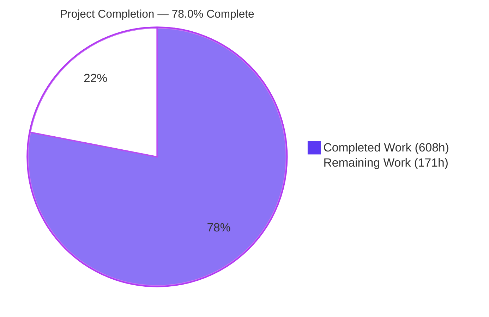
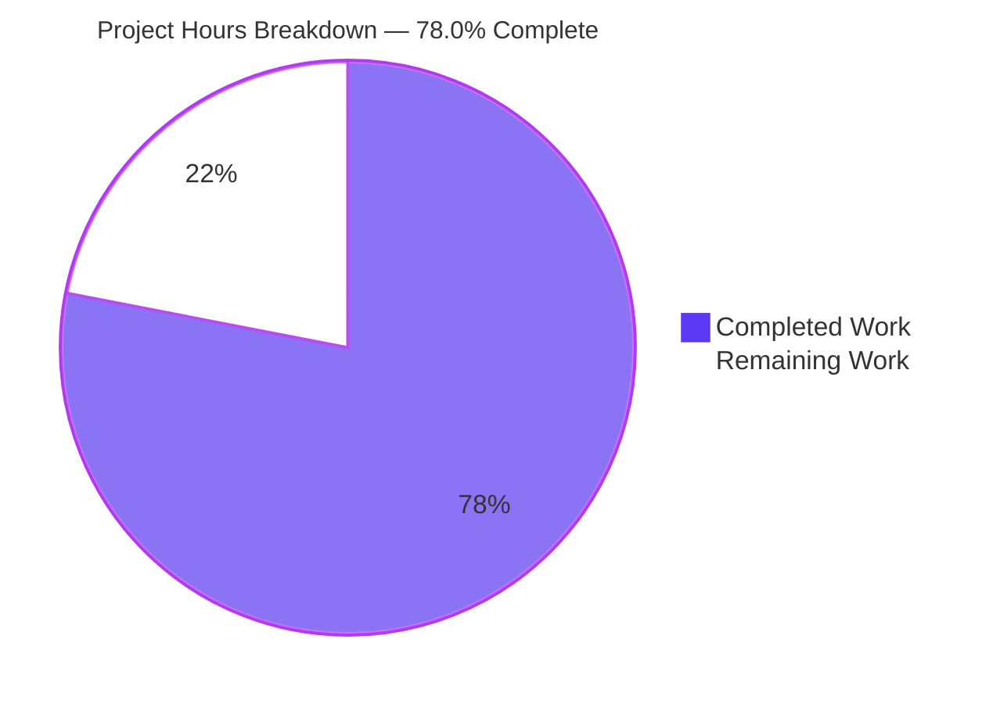
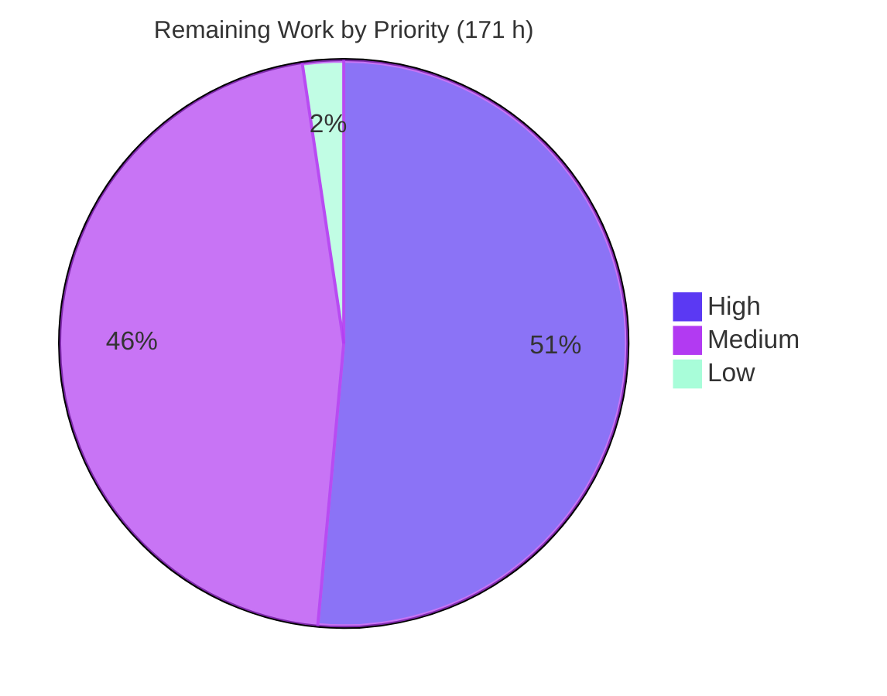

# 1. Executive Summary

## 1.1 Project Overview

trinket-oss is the server-side platform behind Trinket's interactive coding courses — a hapi application serving 233 routes to learners, educators and embedded third-party pages. This work moves it onto Node 22 LTS and `@hapi/hapi` 21.4.10, converting the whole request-handling surface from the 2013 callback idiom to `async (request, h)` handlers that return through the framework toolkit, and replacing only the dependencies that blocked booting, building or testing. Behaviour is held constant: route paths, authentication outcomes, validation decisions, rendered pages, cookie semantics and persisted file formats are unchanged. The platform now sits on a supported runtime with a patchable dependency tree.

## 1.2 Completion Status



| Metric | Value |
|---|---|
| Total Hours | **779 h** |
| Completed Hours (AI + Manual) | **608 h** (608 h autonomous, 0 h manual) |
| Remaining Hours | **171 h** |
| Percent Complete | **78.0 %** |

Completion covers scoped work only — 47 items, of which 41 are closed, 6 carry residue and none is unstarted. `608 / 779 × 100 = 78.0 %`.

## 1.3 Key Accomplishments

- ✅ 233-route HTTP surface preserved entry-for-entry against the base commit.
- ✅ All 154 framework-invoked functions return through the toolkit; the compatibility layer is gone.
- ✅ Suite green from one command, provisioning its own database: 130 of 130 cases pass.
- ✅ Validation accept/reject parity holds on joi 18.2.5 across every target and content mode.
- ✅ 392-scenario response corpus replays with zero unauthorized differences, in both cookie configurations.
- ✅ Export worker proven over 7 real queue jobs; storage and archives over 41 cases.
- ✅ Boots and serves with zero deprecation warnings; 11 of 11 smoke checks pass.
- ✅ Node 22 pinned end to end — `engines`, `.nvmrc` and nine digest-pinned images.

## 1.4 Critical Unresolved Issues

Seven items are open, across 6 of the 47 scoped items: three evidence gaps, four security or platform posture. None stops the application serving.

| Issue | Impact | Owner | ETA |
|---|---|---|---|
| Seven pre-existing security behaviours held unchanged by scope constraint (§5.2, §6) | Unauthenticated metric writes, anonymous interaction data, sign-in without state or nonce, a credential field in one API response | Security owner | 24 h |
| Markdown parser fork carries one unfixable high advisory (§5.2 row 1) | ReDoS exposure over author-supplied course markdown | Platform engineering | 20 h |
| Admin pane output escaping unclosed on the search page (§5.2 row 6) | Authenticated admin-only reflected markup | Security owner | 6 h |
| 53 error-to-response inventory rows open; 52 changed edges have no scenario naming them | Error-path evidence incomplete; the behaviour itself is served and route-covered | QA / verification owner | 32 h |
| Five converted branches measured only at route level, not branch-exactly | Two mutually exclusive response chains per carrier are unproven individually | QA / verification owner | 8 h |
| Two deprecation warnings when the process manager runs as PID 1 in the container | Container log noise; in-process boot is clean | Platform engineering | 4 h |
| Container OS posture — proxy image on a floating tag with fixable highs; base images carry no-fix advisories | Image-scan findings at release review | Release engineering | 8 h |

## 1.5 Access Issues

Nothing blocked build, test or verification. Below are the credentials and resources a deployment needs and this repository cannot carry.

| System/Resource | Type of Access | Issue Description | Resolution Status | Owner |
|---|---|---|---|---|
| AWS S3 | IAM credentials + buckets | Committed configuration declares no `exports` bucket although the export worker reads its name and host; upload and download paths are fixture-driven | Open — deployment prerequisite | Release engineering |
| SMTP relay | Host, port, credentials | Mail is captured by a fixture; no live relay exercised | Open — deployment prerequisite | Release engineering |
| reCAPTCHA | Site and secret keys | All response branches driven from recorded fixtures | Open — deployment prerequisite | Release engineering |
| Google OAuth | Client id and secret | Token exchange and profile fetch driven from recorded fixtures | Open — deployment prerequisite | Release engineering |
| Markdown parser fork | `git+https` dependency | Resolves anonymously today; a move to a private remote would break `npm ci` | Monitored — no action needed | Platform engineering |

## 1.6 Recommended Next Steps

1. **[High]** Rule on the seven pre-existing security behaviours, then re-baseline the corpus.
2. **[High]** Provision deployment secrets, including the undeclared `exports` bucket, and rehearse a staging release.
3. **[High]** Wire the suite and the six verification gates into a pipeline.
4. **[Medium]** Close the error-path evidence gaps and re-capture the corpus.
5. **[Medium]** Rebase the markdown parser fork to clear the last high advisory.

# 2. Project Hours Breakdown

## 2.1 Completed Work Detail

| Component | Hours | Description |
|---|---|---|
| Runtime pinning, dependency migration, lockfile and configuration | 34 | `engines` at `node >=22.0.0 <23.0.0` / `npm >=10.0.0 <11.0.0`, `.nvmrc` at `22`, 17 dependency moves and 17 removals taking the manifest from 58+11 to 40+8 declarations, a lockfile that resolves on a clean cache without legacy peer flags, plus the `strictQuery`, SDK-notice and test-configuration edits |
| Container migration | 36 | Nine Node-bearing images moved to digest-pinned Node 22 (five bookworm, three alpine, one slim, two NodeSource installs inside non-Node bases), four manager manifests and lockfiles regenerated, and `scripts/fetch-components.js` added as a digest-verified idempotent component fetch wired ahead of the CSS build |
| hapi 21 bootstrap and compatibility-layer collapse | 40 | `app.js` on 21.4.10 with an awaited authentication scheme and a non-production session-password default; `lib/util/routeParser.js` reduced to a plain async wrapper — response emulation removed, and the no-controller fallback, per-request debug logging and all three route-table invocation forms preserved byte-identically |
| Async conversion of the 154 framework-invoked functions | 100 | 145 routed handlers across ten controllers plus 8 routed and 1 inline pre-handler converted to `async (request, h)` returning through the toolkit; 202 callback-era response calls removed; every promise chain returned or awaited exactly once per path |
| Node-core, URL-helper and HTTP-transport conversions | 48 | Callback `fs` inside handlers moved to `fs/promises` with fire-and-forget timing preserved, `Buffer.from`, a shared legacy-compatible URL parser at `lib/util/url.js` reproducing partial-object and throwing behaviour, and four HTTP call sites moved to `fetch` with every measured branch preserved |
| Export worker, queue surface and shared-core extraction | 36 | `lib/workers/exports.js` made loadable and adapted to Bull 4 (job identity, completion, retry, stall), cursor streaming and awaited query execution, `lib/util/queues.js` constructor and getters, and two internal re-entrant injections replaced by extracted shared cores preserving both folder-listing cases |
| Test harness repair, database provisioning and suite | 50 | The harness made runnable from a clean tree, where it previously aborted during file collection; a three-file readiness boundary added, the spec glob narrowed, two dead helpers removed, in-memory MongoDB provisioning wired into `npm test`, six new page cases added to the fixed suite sequence, and ten expectations corrected against two-tree evidence |
| Parity harness and committed evidence artifacts | 142 | 25 artifacts under `test/parity/` — route manifest generator, corpus capture and replay with a 392-scenario corpus in both cookie configurations, validation matrix and baseline, storage and worker harnesses, database lifecycle, server overlay, four module-boundary fixtures, three inventory generators and a provenance chain over six artifacts |
| Delivery documentation | 55 | `docs/dependency-inventory.md`, `docs/deferred-dependencies.md`, `docs/preserved-quirks.md` (preserved-behaviour catalogue and deviation registers), `docs/baseline-parity.md`, `docs/conversion-inventory.md`, `docs/error-edge-inventory.md`, and seven updated user-facing documents |
| Gate execution, runtime and browser verification | 67 | Route-manifest and route-table gates, suite, validation, corpus, storage, worker, zero-warning, asset-build, audit and container gates run to a result, plus browser verification of anonymous pages, the identity lifecycle, editor and embed, the admin pane and four viewport widths |
| **Total Completed** | **608** | |

## 2.2 Remaining Work Detail

| Category | Hours | Priority |
|---|---|---|
| Adjudication of seven pre-existing security behaviours — decide each, amend scope, re-baseline the corpus | 24 | High |
| Markdown parser fork rebase under a rendering-parity review | 20 | High |
| CI/CD pipeline running the suite and the six verification gates | 16 | High |
| Staging release rehearsal, smoke run and rollback plan | 12 | High |
| Deployment configuration and secret provisioning, including the undeclared `exports` bucket | 10 | High |
| Admin pane output-escaping follow-up | 6 | High |
| Error-to-response inventory closure — 53 rows in one renumbering pass | 16 | Medium |
| Branch-exact corpus scenarios for the 52 changed error edges, with corpus re-capture and register re-stamp | 16 | Medium |
| Development-dependency modernization clearing five dev-only high advisories | 16 | Medium |
| Monitoring, alerting and log aggregation for the application and the export worker | 10 | Medium |
| Container OS posture — proxy image rebuild off a pinned tag, then a base-image decision | 8 | Medium |
| Branch-exact coverage for five converted branches measured only at route level | 8 | Medium |
| Archive-format and test-configuration sign-off | 5 | Medium |
| Process-manager PID-1 deprecation residue | 4 | Low |
| **Total Remaining** | **171** | |

Reconciliation: Section 2.1 totals **608 h** and Section 2.2 totals **171 h**, summing to the **779 h** stated in Section 1.2, and `608 / 779 × 100 = 78.0 %` — the figure used in Sections 1.2, 7 and 8. By priority the remaining work is High 88 h, Medium 79 h and Low 4 h; by scope it is 123 h traceable to scoped items and 48 h of path-to-production work.

# 3. Test Results

Every figure below was observed by executing the named command against the current tree. Line-coverage instrumentation is not configured in this repository, so the Coverage column states the verified surface each suite actually spans.

| Area / Category | Framework | Tests | Passed | Failed | Coverage | What This Proves |
|---|---|---|---|---|---|---|
| Unit and integration suite (`npm test`) | Mocha 3.5.3, Chai, Sinon, Supertest, in-memory MongoDB | 130 | 130 | 0 | 18 spec files over models, API flows and page routes | Models, authenticated API flows and page rendering behave as the committed assertions require, against a database the run provisions for itself |
| Route surface parity (`verify:routes`) | Route manifest comparator vs the base commit | 233 entries | 233 | 0 | 233 of 233 registered routes | Method, path, controller binding, handler kind and effective auth mode are unchanged for every route; 6 surface changes are registered and authorized, 0 unauthorized |
| Validation parity (`verify:joi`) | Validation matrix harness on joi 18.2.5 | 306 cases / 462 outcomes | 306 | 0 | 102 validation targets, accepting / rejecting / coercing inputs, both content modes | Accept and reject decisions and their response shapes are identical to the base commit after the schema-library major move |
| Response corpus replay (`verify:corpus`) | Capture-and-replay harness, both cookie configurations | 392 scenarios | 391 driven, 0 failing | 0 | 233 routes covered; 29 routes driven on a failure path as well as success; 5 of 5 authentication outcomes | Normalized status, headers, cookies and body shape match the base commit; the one undriven scenario is unreachable by design and recorded as such |
| Storage and archive contract (`verify:storage`) | Storage harness against a filesystem-backed object store | 41 | 41 | 0 | Upload keys, bucket selection, avatar gating, export archive layout, pre-migration lookups | Content-hash storage keys and archive layout are unchanged, so objects written before this work remain findable |
| Export worker (`verify:worker`) | Worker harness over Bull 4.16.5 | 112 checks | 112 | 0 | 7 real jobs: success, missing user, late failure, unknown action, retry, stall, lock loss | The background export pipeline completes, retries, fails and cleans up correctly on the new queue major, with status and progress persisted |
| Runtime smoke (`test/smoke-test.sh`) | Shell HTTP probe against a running server | 11 | 11 | 0 | Home, static assets, public pages, API root, 404 handling | A booted server answers its public pages, its built CSS and its error paths |
| Build and CLI determinism | Vite / Sass build and the route-table CLI | 3 forms | 3 | 0 | Both CSS artifacts plus all three CLI invocation forms | The asset build emits `public/css/base.css` and `public/css/embed.css` from a clean tree, and the route table is byte-identical across no-argument, `-R` and `--routes` |

### Not Covered

- **Server-side execution units (`serverside/**`).** Twenty-nine paths across eight container images and four manager manifests were moved to Node 22; the images build and the manager units boot, but no functional test for that code exists in this repository and none was in scope. A human should exercise one job per language plane before release.
- **Five converted response branches.** `lib/controllers/trinket.js:179` and `:375`, `lib/controllers/users.js:1180` and `:1315`, and `lib/controllers/files.js:535` are covered at route level only; each carries two mutually exclusive response chains, and the individual branches are unproven.
- **Fifty-two changed error edges.** These paths are served and route-covered, but no scenario names their inventory id, so their status, payload and timing are not individually asserted.
- **Captcha transport-failure and malformed-response arms.** Driven through the request fixtures but by no case in the committed unit suite.
- **Language planes other than Python.** Configuration ships every other language disabled, identically to the base commit, so ten language routes answer 404 in every run; the enabled-language paths were not exercised.
- **The remote-asset-fetch route.** `POST /api/users/assetFromURL` answers 501 because the asset feature ships disabled, so its fetch-and-upload path is not entered by any test.
- **The duplicate-folder-name path and `serverside/pygame/worker/entrypoint.sh`.** The first terminates the process when driven — base-commit behaviour — and is recorded unreachable by design; the second is retained and syntactically valid but no test executes it.

# 4. Runtime Validation & UI Verification

- ✅ **Start-up** — the server listens within about three seconds under `--pending-deprecation --trace-deprecation` and emits no deprecation or warning line, before or after traffic. Outside production it generates an ephemeral session secret, so a clean tree boots with no secret file.
- ✅ **Identity lifecycle** — sign-up returns 302 to `/welcome`, login returns 302 to `/home`, and `/home` with the session cookie renders 200 with the signed-in user pane. The cookie carries `HttpOnly; SameSite=Lax; Path=/` and an `Expires` one year ahead, confirming the cookie-expiry extension is live rather than silently inert.
- ✅ **Anonymous browsing and public pages** — `/`, `/login`, `/signup`, `/about`, `/help`, `/python` and `/embed/python` all answer 200; anonymous `GET /api/trinkets` answers 401 as the authentication mode requires.
- ✅ **Routes answered by the no-controller fallback** — `POST /api/interest` answers 200 through the preserved fallback, and the two popular/active listing routes answer exactly as they do at the base commit.
- ✅ **Editor, trinket and embed screens** — driven in a real browser across roughly 1,500 requests with 77 captures: no application console errors and no first-party response of 400 or above, with a deliberate 404 control proving that such responses would have been surfaced.
- ⚠ **Admin pane** — loads for an administrator and no credential hash appears anywhere in the DOM, response body or attributes; output escaping on the search-bearing page is still open (§5.2 row 6).
- ✅ **Responsive layout** — pages verified at 375, 768, 1280 and 1920 px with no horizontal overflow on any load.
- ✅ **Export pipeline** — driven end to end through the queue: archive built and uploaded, storage key and persisted record written, status and progress updated, notification mail produced, temporary files cleaned on both the success and failure paths.
- ⚠ **External integrations** — object storage, mail, captcha and Google sign-in are exercised at the module boundary with recorded responses covering each branch, not against live services.
- ⚠ **Container runtime** — the application image serves its pages and both built CSS artifacts; two deprecation lines appear when the process manager runs as PID 1 (§5.2 row 5).

**Never exercised at runtime:** live object storage, mail, captcha and Google sign-in endpoints; the server-side execution units beyond an image build and a boot check; the remote-asset-fetch route, which answers 501 because the asset feature ships disabled; and every language plane except Python, all of which answer 404 under the shipped feature flags exactly as at the base commit.

# 5. Compliance & Quality Review

## 5.1 Compliance Matrix

Each row states where the deliverable stands now, against the quality benchmark it was scoped to meet.

| Deliverable | Benchmark | Status | Progress | Verified By |
|---|---|---|---|---|
| Node 22 LTS runtime pinning | Runtime bounded and reproducible across manifest, tooling and images | ✅ Pass | ▰▰▰▰▰ 100% | `engines` at `node >=22.0.0 <23.0.0`, `.nvmrc` at `22`, running v22.23.2 with npm 10.9.9 |
| Framework major and plugin set | `@hapi/hapi` 21.x with plugins current and registration unchanged in form | ✅ Pass | ▰▰▰▰▰ 100% | 21.4.10 installed; static-file, view and session plugins register and serve |
| Async conversion of the request surface | Every framework-invoked function returns, returns a promise, or throws | ✅ Pass | ▰▰▰▰▰ 100% | Compatibility layer removed from `lib/util/routeParser.js`; the no-controller fallback preserved and answering |
| HTTP surface invariance | 233 routes identical in method, path, binding, handler kind and effective auth | ✅ Pass | ▰▰▰▰▰ 100% | Manifest comparison: 233 vs 233, 6 authorized changes, 0 unauthorized |
| Validation accept/reject parity | Identical decisions and response shapes after the schema-library major | ✅ Pass | ▰▰▰▰▰ 100% | 102 targets, 306 cases, 462 outcomes, 0 unauthorized differences |
| Error-to-response mapping preservation | Every changed error edge keeps its status, payload, side effects and timing | ⚠ Partial | ▰▰▰▰▱ 86% | Three shared funnels preserved verbatim and corpus-compared; 53 inventory rows still open |
| Session and authentication contract | Same cookie names, attributes and authentication outcomes | ✅ Pass | ▰▰▰▰▰ 100% | 5 of 5 authentication outcomes driven in both cookie configurations; `Expires` horizon asserted |
| Persisted data and file-format contract | Storage keys, bucket selection and archive layout unchanged | ✅ Pass | ▰▰▰▰▰ 100% | 41 of 41 storage cases, including pre-migration lookups and rekey-orphan checks |
| Dependency policy | Replacement only where blocking; deferred packages recorded with reasoning | ⚠ Partial | ▰▰▰▰▱ 92% | 40 production + 8 development declarations; one high advisory retained by design (§5.2 row 1) |
| Harness executes with assertions unweakened | Suite runs from a clean tree and asserts exact values | ⚠ Partial | ▰▰▰▰▱ 95% | 130 of 130 pass; ten expectations corrected against two-tree evidence (§5.2 row 2) |
| Zero deprecation warnings across the running application | No warning attributable to this codebase or a retained dependency | ⚠ Partial | ▰▰▰▰▱ 90% | Clean at boot, across a 233-route replay and in the worker; two remain under the PID-1 supervisor |
| Container pinning and asset build | No image on an old runtime; the build emits both CSS artifacts | ✅ Pass | ▰▰▰▰▰ 100% | Nine Node-bearing images on digest-pinned Node 22; `base.css` 265,727 B and `embed.css` 296,352 B |

## 5.2 AAP & Rule Divergences and Gaps

No user-specified rules were attached to this work, so the benchmark below is the agreed migration plan (AAP) for this codebase, referred to here as *the plan*. Eight divergences were established. Row 6 also appears in Section 1.4 as release-relevant, and rows 1, 3, 5, 6 and 7 carry hours in Section 2.2. Separately — and not a divergence, because the plan required baseline behaviour be preserved — seven pre-existing security behaviours were investigated and left unchanged; they are carried as accepted risk in Sections 1.4 and 6.

| What the Plan Required | What Was Delivered Instead | Why It Diverged | Impact | Remediation |
|---|---|---|---|---|
| 1. No critical and no high advisories from a production audit | Zero critical, one high, seven moderate (the plan projected six) | The markdown parser fork cannot be replaced without changing rendered output; the archive reader the plan authorized carries a no-fix advisory | Bounded ReDoS exposure over author-supplied markdown | Rebase the fork under a rendering-parity review (20 h, §2.2) |
| 2. Existing expected values unchanged | Ten expectations corrected to the value both trees produce; two cases gained assertions | The clause assumed a green starting suite that never existed; each corrected value was measured on both trees | None — all 130 cases assert exact values | Review the corrections and the withdrawn generation change once |
| 3. Archive writer kept at its existing version | Moved to `archiver` 7.0.1 | The old writer uses a removed Buffer constructor at module scope and emits zero CRC and size, so the pinned reader cannot read an export back | Export ZIP byte stream changes; layout, key and records do not | Confirm with any consumer outside this repository (part of 5 h, §2.2) |
| 4. Behaviour improvements prohibited | Three paths that previously returned no response now answer | An unsettled or process-killing request is not behaviour a client can rely on; the plan's own precedent makes "every route serves" prevail | Two process-terminating inputs and one hung download now return responses | None — registered as approved, with base-commit evidence |
| 5. Zero deprecation warnings across the entire running application | Clean in process; two warnings under the PID-1 container supervisor | The warnings originate in the supervisor and no published release of it is clean; silencing them by flag is barred | Container log noise only | Adopt a clean supervisor release or change the entrypoint (4 h, §2.2) |
| 6. View layer frozen and behaviour preserved | Admin search-page output escaping is unclosed | Its closure lived in a template path the same scope requires be byte-identical to the base commit | Authenticated admin-only reflected markup | Serve a content-security policy, or authorize a scoped view change (6 h, §2.2) |
| 7. A fixed edit list for configuration files | A mail block in the test configuration, one mail-secret key in defaults, and the file-watch library retained | Removing them breaks five base-commit assertions, makes a share key derivable, or stops configuration loading outside production | None observed; each is outside the authorized edit list | Authorize each in one line or re-home it (part of 5 h, §2.2) |
| 8. Route surface is an invariant | 233 of 233 entries match with six registered exceptions | Two embed changes were requested by a human refinement instruction (**Sanctioned**); four upload routes needed multipart parsing restored or the new framework major makes them unreachable | Two embed routes now check enrolment; uploads work as before | None — registered and authorized |

**1 — Audit result.** The plan's dependency gate asked for no critical and no high advisories from a production-only audit; the measured result is zero critical, one high and seven moderate. The high is the vendored markdown parser fork, retained deliberately: every tested replacement changes rendered course output and prints a deprecation notice on every parse, and the plan ranks preserving rendered output above the audit target. The seventh moderate is the archive reader pinned by this work, in an advisory range with no forward fix and no extraction call in the tree. The reader decides: accept a bounded exposure over author-supplied markdown, or fund the rebase (`package.json`, `docs/deferred-dependencies.md`).

**2 — Corrected expectations.** Ten expected values were corrected, each to the value that this tree and the base commit both produce, verified with a recorded side-by-side command — among them a redirect that renders an empty body, a template placeholder inside a raw block, anonymous API writes answering 401 rather than 302, and collection fields arriving empty rather than absent. Two cases gained assertions. One correction withdrew a code change that had truncated share-code generation from twelve characters to ten to satisfy a stale expectation. Nothing was weakened; every one of the 130 cases still asserts an exact value (`test/lib/`).

**3 — Archive writer.** The plan lists the archive writer as unchanged, but the old major constructs a Buffer through the removed constructor at module scope and its writer emits zero CRC and zero declared size, so the archive reader the plan pins cannot read an export back at all. After the move the storage cases pass 41 of 41, the worker gate passes, boot stays warning-free and the audit result is unchanged. Entry layout, storage key and persisted records are identical; only the ZIP byte stream differs. Confirm that with any consumer outside this repository before release (`lib/workers/exports.js`, `test/parity/storage.js`).

**4 — Three paths that now serve.** A percent-encoded control byte in an embed path terminated the process — reproduced identically at the base commit — and the duplicate-folder-name path did the same; the image-download branch built a response and never sent it. The plan's own precedent governs: an unsettled or process-killing request is not behaviour a client can depend on, so the requirement that every route serves prevails over strict preservation. The image branch now returns the same stream response its sibling four lines below already returned. All three are registered with their base-commit evidence and need no further action (`lib/controllers/files.js`, `docs/preserved-quirks.md`).

**5 — Supervisor warnings.** In process the zero-deprecation requirement is met: boot, a full 233-route replay and the worker run each produce no deprecation line. Two warnings remain when the process manager runs as PID 1 inside the container, and they originate in that supervisor rather than in this codebase — no published release of it is clean, and the plan's wording bars silencing warnings with a flag. The impact is container log noise, not request behaviour. The way out is to track the supervisor for a clean release and adopt it, or change the container entrypoint (`Dockerfile`, `scripts/pm2/`).

**6 — Admin escaping.** The plan freezes the view layer and prohibits behaviour changes, so an output-escaping fix on the admin search page could not stand: its closure lived in a template path the same scope requires be byte-identical to the base commit, and that restoration reopened it. The reflected markup is reachable only by an authenticated administrator on a query-bearing page, and the companion concern is closed — no credential hash is rendered anywhere, confirmed in a real browser. A human must either serve a content-security policy, which needs no template change, or authorize a scoped edit to the view and its filter consumer (`lib/views/admin/includes/users.html`).

**7 — Configuration additions.** Three configuration facts sit outside the agreed edit list. `config/test.yaml` carries a mail block beyond the two authorized keys; without it five base-commit assertions fail and the suite drops to 125 cases, so the assertions-unweakened requirement outranked the edit list. `config/default.yaml`, which the plan says is untouched, gains one mail-secret key, which stops an undeclared value resolving to the literal string `undefined` and making an email share key derivable. The file-watch library the removals table directs removing is retained, because removing it stops configuration loading under test and development. Each needs a one-line authorization or a re-home.

**8 — Route surface.** The surface is an invariant and 233 of 233 entries match the base commit field for field, with six registered exceptions. Two embed routes now apply an enrolment check they never applied — sanctioned, because a human refinement instruction asked for it. Four upload routes have multipart parsing restored inside the route parser, because the new framework major defaults it off and the body parser then answers 415, which would make those routes unreachable to every shipped client. Separately the framework emits only cookie clears on any response carrying a 500, with no option to disable; that reaches 13 of 231 cookie-bearing steps and the other 218 compare exactly.

# 6. Risk Assessment

Risks are forward-looking: what could still go wrong in production with the code as it stands.

| Risk | Category | Severity | Probability | Mitigation | Status |
|---|---|---|---|---|---|
| Seven pre-existing behaviours left unchanged by the preservation requirement: no session-id rotation on registration, an unauthenticated metrics write, anonymous access to interaction data, a secret compared against an empty configured default, sign-in without state or nonce, legacy images served inline with their stored type, and one API response returning the caller's own credential hash | Security | High | Medium | Decide each, amend scope where a fix is wanted, then re-baseline the response corpus; all seven are present identically at the base commit | Open — accepted by scope (24 h, §2.2) |
| Markdown parser fork carries an unfixable ReDoS advisory | Security / Technical | High | Low | Exposure is author-supplied course markdown through a single consumer; rebase the fork under a rendering-parity review | Open — accepted with a caveat (20 h) |
| No pipeline, monitoring or release rehearsal exists, so every gate is run by hand and a regression can reach a deploy unseen | Operational | High | High | Wire the suite and the six verification gates into CI; add health and metric collection; rehearse a release | Open (38 h across §2.2) |
| Four external integrations are configured but never driven against live services, and committed configuration declares no export bucket although the worker reads one | Integration | Medium | High at first deploy | Provision credentials and the bucket, then run the smoke script and one real export in staging | Open (22 h across §2.2) |
| Deferred dependency majors — the object-storage SDK past end of support, the ODM plus its prototype-patching extension whose load order is load-bearing, and three further old majors | Technical | Medium | Medium | Schedule as separate work with its own parity review; the load-order rule is documented in code and enforced by import ordering | Deferred by design, recorded |
| Export archive byte stream changed with the new archive writer | Technical | Medium | Low | Layout, storage key and persisted records are unchanged and asserted by 41 storage cases and 7 worker jobs; confirm with any external consumer | Open — sign-off pending (part of 5 h) |
| Container image OS posture: base images carry advisories with no published fix behind the upgrade the build already runs, and the proxy image sits on a floating tag with fixable highs | Security / Operational | Medium | Medium | Rebuild the proxy image off a pinned tag, then take a base-image refresh decision | Open (8 h, §2.2) |
| Error-path evidence is incomplete — 53 inventory rows open and 52 changed edges without a scenario naming them — so an error-path regression could pass the current gates | Technical | Medium | Medium | Close the inventory in one renumbering pass and add branch-exact scenarios with a corpus re-capture | Open (32 h, §2.2) |

# 7. Visual Project Status





### Remaining Hours by Category

| Category | Hours | Share |
|---|---|---|
| Security adjudication and follow-up | 30 | ▰▰▰▰▰▰▰▰▰▰▰▰ |
| Dependency and advisory work | 36 | ▰▰▰▰▰▰▰▰▰▰▰▰▰▰ |
| Verification evidence completion | 40 | ▰▰▰▰▰▰▰▰▰▰▰▰▰▰▰▰ |
| Platform and container posture | 17 | ▰▰▰▰▰▰▰ |
| Path to production (pipeline, secrets, monitoring, rehearsal) | 48 | ▰▰▰▰▰▰▰▰▰▰▰▰▰▰▰▰▰▰▰ |
| **Total** | **171** | |

### Scoped Item Status

| Status | Items | Share of 47 |
|---|---|---|
| Closed | 41 | 87.2 % |
| Carrying residue | 6 | 12.8 % |
| Not started | 0 | 0 % |

Colour key — Completed work: Dark Blue `#5B39F3` · Remaining work: White `#FFFFFF` · Accents: Violet-Black `#B23AF2` · Highlight: Mint `#A8FDD9`.

# 8. Summary & Recommendations

**What was delivered.** trinket-oss now runs on Node 22 LTS under `@hapi/hapi` 21.4.10, with the whole request-handling surface converted to the framework's own contract: all 154 handlers and pre-handlers the framework invokes return their responses through the toolkit, the out-of-band response emulation that kept the 2013 idiom alive is gone, and the no-controller fallback three routes depend on is preserved and still answering. The dependency tree fell from 58 production and 11 development declarations to 40 and 8, with a lockfile that resolves on a clean cache without legacy peer flags. Every Node-bearing container image is on digest-pinned Node 22, the asset build emits both CSS artifacts from a clean tree, and the test suite provisions its own database and passes 130 of 130 cases from a single command. The project is **78.0 % complete** against its scoped work — 608 of 779 hours.

**What was proven.** Behaviour invariance is the hard requirement of a migration like this, and it is evidenced rather than asserted. The 233-route surface matches the base commit entry for entry in method, path, controller binding, handler kind and effective authentication, with six registered and authorized exceptions. Validation decisions match across 102 targets, 306 cases and 462 outcomes after a schema-library major move. A 392-scenario response corpus replays in both cookie configurations with zero unauthorized differences, covering all 233 routes and all five authentication outcomes, and 29 routes on a failure path as well as a success path. Storage keys, bucket selection and archive layout pass 41 of 41 cases — the contract that keeps objects written before this work findable. The export pipeline passes 112 checks over seven real queue jobs. The server boots and serves with no deprecation warning at all.

**What remains.** The 171 remaining hours fall into four bands. Forty-eight are ordinary path-to-production work this repository has never had: a pipeline, secrets and bucket provisioning, monitoring, and a staging rehearsal. Fifty-four are security decisions and their follow-through — seven pre-existing behaviours that the preservation requirement kept frozen and a human must now rule on, the markdown parser fork that holds the last high advisory, and an admin escaping gap whose fix needs a scope exception. Forty are verification-evidence completion: 53 error-path inventory rows, scenarios for 52 changed error edges, and five branches proven only at route level. The last 29 are platform posture and sign-offs — development-dependency advisories, container base images, the supervisor's PID-1 warnings, and confirmation of the archive byte-stream change.

**Critical path to production.** Provision the deployment configuration first, because it is the only item that can stop a release outright: object-storage credentials plus an `exports` bucket that committed configuration does not declare, a mail relay, captcha keys and sign-in credentials. In parallel, rule on the seven security behaviours — some may be acceptable, but the unauthenticated metrics write and the credential field in one API response deserve a decision before public traffic. Then rehearse a release in staging with the smoke script and one real export end to end, and wire the suite and the six verification gates into CI so the parity evidence keeps working after the next change. Everything else can follow a first deploy.

**Production readiness.** The application is functionally ready and, on the evidence above, behaviourally equivalent to the code it replaces; what it is not yet is *operationally* ready, and nothing in the remaining work is a rewrite. Success metrics for the next stage are concrete: the suite and all six gates green in CI on every push; one real export completed against live object storage; zero unauthorized corpus differences after the error-edge scenarios land; and a production audit at zero high advisories once the parser fork is rebased. Treat the seven frozen security behaviours as the release gate that needs a human signature — every other open item is schedulable.

# 9. Development Guide

Every command below was executed against this tree and the stated output is what it produced. Run them from the repository root unless told otherwise.

### System Prerequisites

| Requirement | Version | Notes |
|---|---|---|
| Node.js | `>=22.0.0 <23.0.0` — verified on v22.23.2 | Enforced by `engines`; `.nvmrc` contains `22` |
| npm | `>=10.0.0 <11.0.0` — verified on 10.9.9 | npm 11 installs but emits `EBADENGINE`; use npm 10 |
| MongoDB | Provided automatically for tests | `npm test` starts an in-memory server (mongod 8.2.6) on a random port with a per-run database |
| Redis | 6+ | Only needed for the worker verification gate; the application runs without it when Redis is disabled |
| Docker | 24+ — verified on 29.7.0 | Only for building the container images |
| Disk | ~1.5 GB free | The component bundle alone is 436 MB across 6,721 files |

```bash
# Select the pinned runtime and confirm the toolchain
nvm use            # reads .nvmrc -> 22
node -v            # v22.23.2
npm -v             # must satisfy >=10.0.0 <11.0.0
```

### Environment Setup

No `.env` file is used. Configuration is layered YAML under `config/`, overridable at runtime with the `NODE_CONFIG` environment variable. Nothing needs to be created for local development: outside production the application generates an ephemeral session secret and an ephemeral mail-share secret at boot and logs one informational line for each.

```bash
# Optional local overrides that survive restarts
#   config/local.yaml  (gitignored) — e.g. a fixed session password:
#   app:
#     plugins:
#       session:
#         cookieOptions:
#           password: "a-string-of-at-least-32-characters"
```

Two configuration facts matter in practice. `db.redis.enabled` **absent reads as enabled**, so pass `{"db":{"redis":{"enabled":false}}}` for a Redis-less run. And cross-origin credentialed state-changing requests are answered 403 by design, because `app.security.trustedOrigins` ships empty — submit forms same-origin.

### Dependency Installation

```bash
npm ci             # exit 0, no --legacy-peer-deps needed
```

The markdown parser resolves from a public `git+https` remote, so `npm ci` needs network access but no credentials. To skip the in-memory MongoDB binary download during install, set `MONGOMS_DISABLE_POSTINSTALL=1` and supply `MONGOMS_DOWNLOAD_DIR` when you later run the tests.

### Build

```bash
npm run build      # = fetch-components && build:css
```

Observed output: the component fetch verified 6,721 files and 543 directories (436,422,270 bytes) against the recorded tree manifest in about half a second and downloaded nothing, then Vite built in ~2 s and wrote:

```text
public/css/base.css    265,727 bytes
public/css/embed.css   296,352 bytes
```

On a tree without `public/components`, the same command downloads the pinned release bundle and verifies its SHA-256 before extracting. `npm run build:css` rebuilds only the stylesheets. A Vite notice that `outDir` and `publicDir` are the same folder is expected, as are Sass deprecation lines from the vendored CSS framework.

### Running the Application

```bash
# Test-style run: an in-memory MongoDB is started for the process
NODE_CONFIG='{"app":{"url":{"protocol":"http","hostname":"127.0.0.1","port":3000},
"hostname":"127.0.0.1","port":3000},"db":{"redis":{"enabled":false}}}' \
node test/parity/mongo.js -- node --pending-deprecation --trace-deprecation app.js
```

```bash
# Against your own MongoDB
NODE_CONFIG='{"db":{"mongo":{"host":"127.0.0.1","port":27017,"database":"trinket"},
"redis":{"enabled":false}}}' node app.js
```

Wait for `Server started on port: 3000` — about three seconds. Under `--pending-deprecation --trace-deprecation` the run prints no deprecation line at all; the only startup lines are the in-memory queue notice and the generated-secret notice.

### Verification Steps

```bash
npm test                               # 130 registered, 130 executed, 130 passing, 0 failing
bash test/smoke-test.sh http://127.0.0.1:3000   # 11 passed, 0 failed  (URL is POSITIONAL)

npm run verify:storage                 # 41/41 cases
npm run verify:worker                  # 112/112 checks over 7 real queue jobs (needs Redis)
npm run verify:joi                     # validation parity gate
npm run verify:corpus                  # 392-scenario replay, both cookie configurations
npm run verify:parity                  # runs routes, joi, storage, worker and corpus in order
```

Set `MONGOMS_DOWNLOAD_DIR` to a writable cache directory (and `MONGOMS_RUNTIME_DOWNLOAD=false` once it is populated) to avoid re-downloading the MongoDB binary. Use `PARITY_OUT` to give each run its own artifact directory and `PARITY_PORT` its own port when several run side by side.

The route-surface gate compares against the base commit, so it needs a second checkout with its own dependencies:

```bash
git worktree add --detach <baseline-dir> 2f8712a
cd <baseline-dir> && npm ci && cd -
BASELINE_APP=<baseline-dir> npm run verify:routes     # 233 vs 233, exit 0
```

```bash
# Route table — byte-identical across all three invocation forms
NODE_CONFIG='{"db":{"redis":{"enabled":false}}}' NODE_ENV=test \
  node lib/util/routeParser.js -R | md5sum   # 63c44cffd7849145469d21027b81ca85
```

### Example Usage

```bash
# Create an account (form-encoded, same-origin)
curl -i -X POST http://127.0.0.1:3000/users \
  -d 'formName=signup&fullname=Dev User&username=devuser&email=dev@example.com&password=secret1'
#   HTTP/1.1 302 Found ; Location: /welcome
#   Set-Cookie: session=Fe26.2**... ; HttpOnly; SameSite=Lax; Path=/; Expires=<+1 year>

# Sign in and reuse the cookie
curl -i -c jar.txt -X POST http://127.0.0.1:3000/login \
  -d 'email=dev@example.com&password=secret1'          # 302 -> /home
curl -s -b jar.txt -o /dev/null -w '%{http_code}\n' http://127.0.0.1:3000/home   # 200

# Anonymous API access is rejected by the session strategy
curl -s -o /dev/null -w '%{http_code}\n' http://127.0.0.1:3000/api/trinkets      # 401

# Grant administrator rights to an existing account
node scripts/make-admin.js dev@example.com
```

### Troubleshooting

| Symptom | Cause | Resolution |
|---|---|---|
| `EBADENGINE` on install | npm 11 against the pinned `>=10 <11` range | Install and use npm 10 |
| Smoke script reports 0 passed / 11 failed | The base URL was passed as an environment variable or flag | It is positional: `bash test/smoke-test.sh http://host:port` |
| Build fails inside the vendored CSS framework | `public/components` missing | Run `npm run fetch-components` (or `npm run build`, which calls it) |
| Queue errors reaching for `localhost:6379` | `db.redis.enabled` is absent, which reads as enabled | Pass `{"db":{"redis":{"enabled":false}}}` in `NODE_CONFIG` |
| Process exits at start-up complaining about the session password | Production mode with no configured secret | Set `app.plugins.session.cookieOptions.password` to 32+ characters; outside production one is generated |
| A published container port answers nothing | `app.hostname` still `127.0.0.1` inside the container | Bind `0.0.0.0` in the container and publish to your host port |
| `verify:routes` refuses to run | No base-commit checkout supplied, or it points at this tree | Provide `BASELINE_APP` (a worktree at `2f8712a` with its own `node_modules`) or `BASELINE_MANIFEST` |
| A stopped server keeps answering | The in-memory MongoDB wrapper and the application are two processes | Terminate the wrapper and the application pid it logs (`running \`node … app.js\` … (pid N)`) |
| Cross-origin form POST answers 403 | `app.security.trustedOrigins` is empty by design | Submit same-origin, or add the origin to configuration |
| Image build cannot fetch components | No outbound network during the build | Pre-populate `public/components` in the build context, or allow egress to the release host |

# 10. Appendices

### A. Command Reference

| Command | Purpose | Observed result |
|---|---|---|
| `npm ci` | Install from the lockfile | Exit 0; no legacy peer flags required |
| `npm run fetch-components` | Digest-verified, idempotent component fetch | Verified 6,721 files / 543 dirs (436,422,270 B); no download |
| `npm run build:css` | Build the stylesheets | Exit 0 in ~2 s; both CSS artifacts written |
| `npm run build` | `fetch-components` then `build:css` | Exit 0 |
| `npm test` | Unit and integration suite with its own MongoDB | 130 registered / 130 executed / 130 passing / 0 failing |
| `npm run verify:routes` | Route-surface comparison against the base commit | Exit 0; 233 vs 233; 6 authorized, 0 unauthorized |
| `npm run verify:joi` | Validation accept/reject parity | Exit 0; 0 unauthorized differences |
| `npm run verify:storage` | Storage and archive contract | Exit 0; 41/41 |
| `npm run verify:worker` | Queue and export worker behaviour | Exit 0; 112/112 over 7 jobs |
| `npm run verify:corpus` | 392-scenario response replay, both cookie passes | Exit 0; 391 driven, 0 failing |
| `npm run verify:parity` | All five parity gates in sequence | Fails if any gate fails |
| `node lib/util/routeParser.js [-R\|--routes]` | Print the route table | Byte-identical across all three forms |
| `node scripts/make-admin.js <email>` | Grant administrator rights | Prints usage and exits 1 with no argument |
| `bash test/smoke-test.sh <base-url>` | HTTP smoke check | 11 passed / 0 failed |
| `docker build -t <tag> .` | Build the application image | Node 22, digest-pinned base |
| `docker build -t <tag> ./serverside/<unit>` | Build an execution-plane image | Nine units, all on Node 22 |

### B. Port Reference

| Port | Service | Source |
|---|---|---|
| 3000 | Application HTTP | `config/default.yaml` (`hostname 0.0.0.0`, `port 3000`) |
| 3010 | Parity gate server (override with `PARITY_PORT`) | Gate scripts |
| 3030 | Trinket worker | `config/default.yaml` |
| 27017 | MongoDB | `config/default.yaml`; tests use a random port instead |
| 6379 | Redis (queues) | `config/default.yaml`; override with `PARITY_REDIS` |
| 587 | SMTP | `config/default.yaml` |
| 8100 / 8200 / 8300 | Execution-plane managers (python and pygame / java / r) | `serverside/*/manager/config/default.json` |
| 3000 → 3000, 16379 → 6379, 17017 → 27017 | Compose published ports | `docker-compose.yml` |

### C. Key File Locations

| Path | What it is |
|---|---|
| `app.js` | Bootstrap: plugin registration, authentication scheme, error mapping, cookie-expiry extension |
| `lib/util/routeParser.js` | Route DSL parser, async wrapper, response helpers, validation block, no-controller fallback, route-table CLI |
| `lib/controllers/` | Ten controllers holding the 145 routed handlers |
| `lib/util/helpers.js` | Named pre-handlers |
| `lib/util/url.js` | Legacy-compatible URL parser shared by the six former call sites |
| `lib/util/{file,store,queues,recaptcha,mailer}.js` | Storage, queue and external-service adapters |
| `lib/workers/exports.js` | Background export worker |
| `config/` | Layered YAML plus route declarations, database, storage and application configuration |
| `scripts/fetch-components.js` | Digest-verified component retrieval, used by the host build and the image build |
| `test/lib/` | 18 spec files, 130 cases |
| `test/parity/` | 25 verification artifacts: manifest, corpus capture/replay, validation matrix, storage, worker, database lifecycle, server overlay, fixtures, inventory generators |
| `test/smoke-test.sh` | Unauthenticated HTTP smoke check |
| `docs/dependency-inventory.md` | Every replaced or bumped package with its reason and resolved version |
| `docs/deferred-dependencies.md` | Unmaintained-but-functional packages and the accepted advisories |
| `docs/preserved-quirks.md` | Catalogue of preserved behaviours and the registered deviations |
| `docs/baseline-parity.md` | Parity method, coverage accounting and the resolution log |
| `docs/conversion-inventory.md` | Per-site conversion checklist |
| `docs/error-edge-inventory.md` | Per-edge error-to-response dispositions |

### D. Technology Versions

| Component | Version |
|---|---|
| Node.js / npm | 22.23.2 / 10.9.9 |
| `@hapi/hapi` | 21.4.10 |
| `@hapi/inert` · `@hapi/vision` · `@hapi/yar` · `@hapi/boom` | 7.1.2 · 7.0.3 · 11.0.3 · 10.0.1 |
| joi | 18.2.5 |
| mongoose | 6.13.9 (deferred by design) |
| bull | 4.16.5 |
| aws-sdk | 2.1693.0 (deferred by design) |
| nodemailer · bcrypt · jsonwebtoken · js-yaml | 9.1.1 · 6.0.0 · 9.0.3 · 4.3.2 |
| adm-zip · archiver · mime · accepts | 0.6.0 · 7.0.1 · 4.1.0 · 1.3.8 |
| validator · tmp · csv · diff · lodash | 13.15.35 · 0.2.7 · 6.6.3 · 8.0.4 · 4.18.1 |
| nunjucks · redis · winston | 3.2.4 · 4.7.1 · 3.19.0 |
| mocha · sinon · chai · supertest | 3.5.3 · 22.1.0 · 3.5.0 · 0.8.3 |
| mongodb-memory-server (mongod) | 11.2.0 (8.2.6) |
| vite · sass | 4.5.14 · 1.98.0 |
| Container bases | `node:22-bookworm`, `node:22-alpine`, `node:22-slim` — all digest-pinned |

Declaration counts: 40 production and 8 development dependencies, down from 58 and 11.

### E. Environment Variable Reference

| Variable | Used by | Purpose |
|---|---|---|
| `NODE_ENV` | Application, tests | Selects the configuration layer; anything other than `production` enables the generated secrets |
| `NODE_CONFIG` | Application, all gates | JSON overlay merged over the YAML configuration — ports, database address, `db.redis.enabled`, session password |
| `NODE_CONFIG_PERSIST_ON_CHANGE`, `NODE_CONFIG_DISABLE_FILE_WATCH` | Tests | Keep the configuration library quiet and deterministic under test |
| `MONGOMS_DOWNLOAD_DIR` | Tests, gates | Cache directory for the in-memory MongoDB binary |
| `MONGOMS_RUNTIME_DOWNLOAD`, `MONGOMS_DISABLE_POSTINSTALL` | Install, tests | Suppress binary downloads when the cache is already populated |
| `PARITY_OUT` | Gates | Artifact output directory; give concurrent runs their own |
| `PARITY_PORT` | Gates | Port for the gate-managed server |
| `PARITY_REDIS` | Worker gate | `host:port` of the Redis to use |
| `PARITY_ATTEST` | Corpus gate | Emit an attestation alongside the replay result |
| `BASELINE_APP` / `BASELINE_MANIFEST` | Route gate | Base-commit checkout, or a manifest generated from one |

The application itself reads no credentials from the environment: object-storage, mail, captcha and sign-in settings all come from the configuration layers.

### F. Developer Tools Guide

- **Route table.** `node lib/util/routeParser.js -R` prints every registered route with its bindings; the module self-executes, so the no-argument form prints the same table, and output is byte-identical across all three invocation forms.
- **Route manifest.** `test/parity/manifest.js --out <file>` emits the 233-entry surface as JSON — method, path, controller binding, handler kind, templates and effective authentication — and `--compare <baseline> <target>` diffs two manifests field by field.
- **Response corpus.** `test/parity/capture.js` records scenarios against a running server and `test/parity/replay.js` drives and diffs them with a defined normalization; both cookie configurations are driven with `--pass both`.
- **Validation matrix.** `test/parity/joi-matrix.js --capture` and `--compare` walk every validation target with accepting, rejecting and coercing inputs in both content modes.
- **Fixtures.** `test/parity/fixtures/{aws,mail,http,model}.js` intercept object storage, mail, outbound HTTP and model faults at the module boundary, so runs are reproducible without network access.
- **Inventory generators.** `test/parity/convert-inventory.js` and `test/parity/error-edges.js` regenerate `docs/conversion-inventory.md` and `docs/error-edge-inventory.md` from the tree; `--check` verifies a committed inventory still matches.
- **Database lifecycle.** `test/parity/mongo.js -- <command>` starts an in-memory MongoDB, publishes its address into the configuration overlay, runs the command and tears down on exit, failure or signal.

### G. Glossary

| Term | Meaning |
|---|---|
| Base commit | `2f8712a`, the revision this work started from and the reference every parity comparison uses |
| Lifecycle method | Any function the framework invokes for a request — handler, pre-handler, extension or authentication scheme; each must return a value, return a promise, or throw |
| Toolkit (`h`) | The framework's response builder passed as the second handler argument |
| Pre-handler | A lifecycle method that runs before the route handler and contributes a value to `request.pre` |
| Compatibility layer | The former response-emulation machinery that let callback-era handlers signal a response out of band; removed by this work |
| No-controller fallback | The parser branch answering routes whose named controller method does not exist; three registered routes depend on it |
| Response corpus | The recorded set of scenarios — route, identity, content mode and intended path — replayed to prove response equivalence |
| Authorized difference | A response or surface difference recorded in advance with its reason, so the gate distinguishes it from a regression |
| Normalization | The defined set of volatile fields (generated ids, timestamps, cookie values) excluded from exact comparison |
| Content-hash storage key | The upload key derived from the file's own digest; changing the digest would orphan every stored object |
| Execution plane | The `serverside/` units that run learner code per language, deployed separately from this application |
